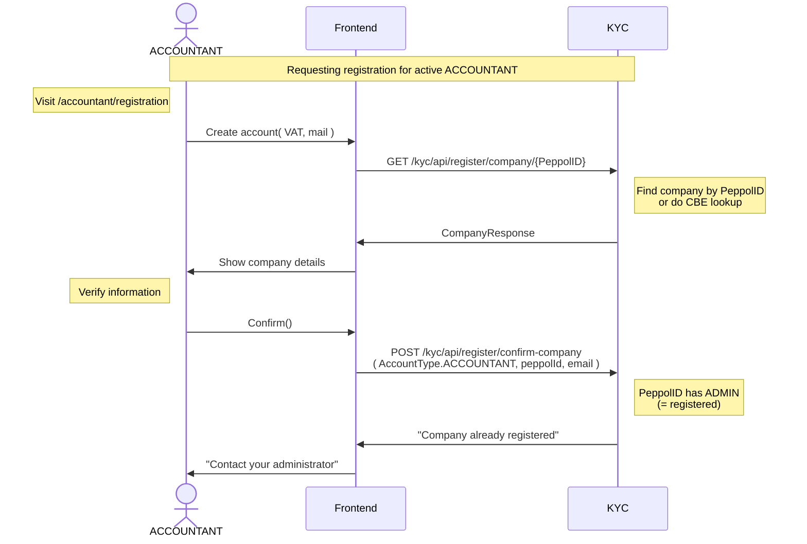

# Registration active ADMIN

```mermaid
sequenceDiagram
    actor ACCOUNTANT as ACCOUNTANT
    participant Frontend as Frontend
    participant KYC as KYC
    %%participant App as App
    %%participant PeppolDirectory as PeppolDirectory
    %%participant Proxy as Proxy
    %%participant Peppol as Peppol

Note over ACCOUNTANT, KYC: Requesting registration for active ACCOUNTANT
    Note left of ACCOUNTANT: Visit /accountant/registration
    ACCOUNTANT ->> Frontend: Create account( VAT, mail )
    Frontend ->> KYC: GET /kyc/api/register/company/{PeppolID}
    Note right of KYC: Find company by PeppolID <br> or do CBE lookup
    KYC ->> Frontend: CompanyResponse
    Frontend ->> ACCOUNTANT: Show company details

    Note left of ACCOUNTANT: Verify information
    ACCOUNTANT ->> Frontend: Confirm()
    Frontend ->> KYC: POST /kyc/api/register/confirm-company <br> ( AccountType.ACCOUNTANT, peppolId, email )
    Note right of KYC: PeppolID has ADMIN <br>(= registered)
    KYC ->> Frontend: "Company already registered"
    Frontend ->> ACCOUNTANT: "Contact your administrator"
```
