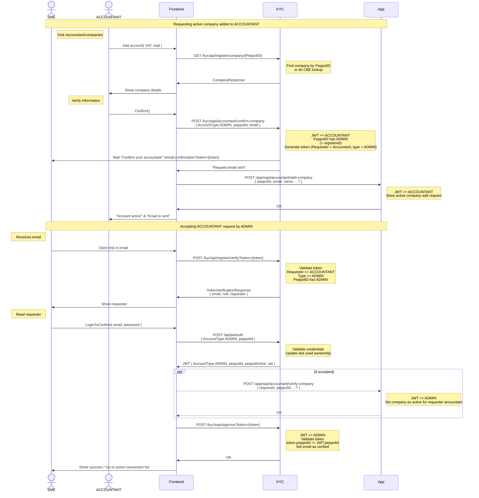

# Registration existing ADMIN via ACCOUNTANT and verify by email

```mermaid
sequenceDiagram
    actor SME as SME
    actor ACCOUNTANT as ACCOUNTANT
    participant Frontend as Frontend
    participant KYC as KYC
    participant App as App
    %%participant PeppolDirectory as PeppolDirectory
    %%participant Proxy as Proxy
    %%participant Peppol as Peppol

Note over SME, App: Requesting active company added to ACCOUNTANT
    Note left of ACCOUNTANT: Visit /accountant/companies
    ACCOUNTANT ->> Frontend: Add account( VAT, mail )
    Frontend ->> KYC: GET /kyc/api/register/company/{PeppolID}
    Note right of KYC: Find company by PeppolID <br> or do CBE lookup
    KYC ->> Frontend: CompanyResponse
    Frontend ->> ACCOUNTANT: Show company details

    Note left of ACCOUNTANT: Verify information
    ACCOUNTANT ->> Frontend: Confirm()
    Frontend ->> KYC: POST /kyc/sapi/accountant/confirm-company <br> ( AccountType.ADMIN, peppolId, email )
    Note right of KYC: JWT == ACCOUNTANT <br> PeppolID has ADMIN <br>(= registered) <br> Generate token (Requester = Accountant, type = ADMIN)
    KYC ->> SME: Mail "Confirm your accountant" /email-confirmation?token={token}
    KYC ->> Frontend: "Request email sent"
    Frontend ->> App: POST /app/sapi/accountant/add-company <br> ( peppolId, email, name, ...? )
    Note right of App: JWT == ACCOUNTANT <br> Store active company add request
    App ->> Frontend: OK
    Frontend ->> ACCOUNTANT: "Account active" & "Email is sent"

Note over SME, App: Accepting ACCOUNTANT request by ADMIN
    Note left of SME: Receives email
    SME ->> Frontend: Open link in email
    Frontend ->> KYC: POST /kyc/api/register/verify?token={token}
    Note right of KYC: Validate token <br> Requester == ACCOUNTANT <br> Type == ADMIN <br> PeppolID has ADMIN
    KYC ->> Frontend: TokenVerificationResponse <br> ( email, null, requester )
    Frontend ->> SME: Show requester

    Note left of SME: Read requester
    SME ->> Frontend: LoginToConfirm( email, password )
    Frontend ->> KYC: POST /api/jwt/auth <br> ( AccountType.ADMIN, peppolId )
    Note right of KYC: Validate credentials <br> Update last used ownership
    KYC ->> Frontend: JWT ( AccountType.ADMIN, peppolId, peppolActive, uid )
    opt if accepted
        Frontend -->> App: POST /app/sapi/accountant/verify-company <br> ( requester, peppolId, ...? )
        Note right of App: JWT == ADMIN <br> Set company as active for requester accountant
        App -->> Frontend: OK
    end
    Frontend ->> KYC: POST /kyc/sapi/approve?token={token}
    Note right of KYC: JWT == ADMIN <br> Validate token <br> token.peppolId == JWT.peppolId <br> Set email as verified
    KYC ->> Frontend: OK
    Frontend ->> SME: Show success / Go to active connection list
```
