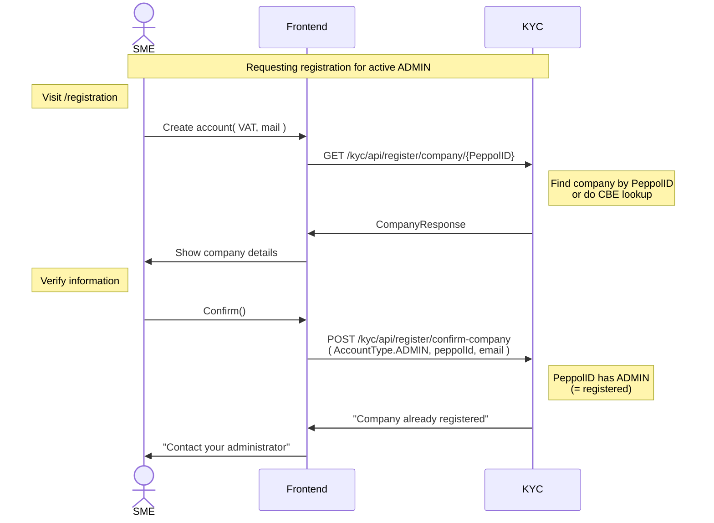

# Registration active ADMIN

```mermaid
sequenceDiagram
    actor SME as SME
    participant Frontend as Frontend
    participant KYC as KYC

Note over SME, KYC: Requesting registration for active ADMIN
    Note left of SME: Visit /registration
    SME ->> Frontend: Create account( VAT, mail )
    Frontend ->> KYC: GET /kyc/api/register/company/{PeppolID}
    Note right of KYC: Find company by PeppolID <br> or do CBE lookup
    KYC ->> Frontend: CompanyResponse
    Frontend ->> SME: Show company details

    Note left of SME: Verify information
    SME ->> Frontend: Confirm()
    Frontend ->> KYC: POST /kyc/api/register/confirm-company <br> ( AccountType.ADMIN, peppolId, email )
    Note right of KYC: PeppolID has ADMIN <br>(= registered)
    KYC ->> Frontend: "Company already registered"
    Frontend ->> SME: "Contact your administrator"
```
