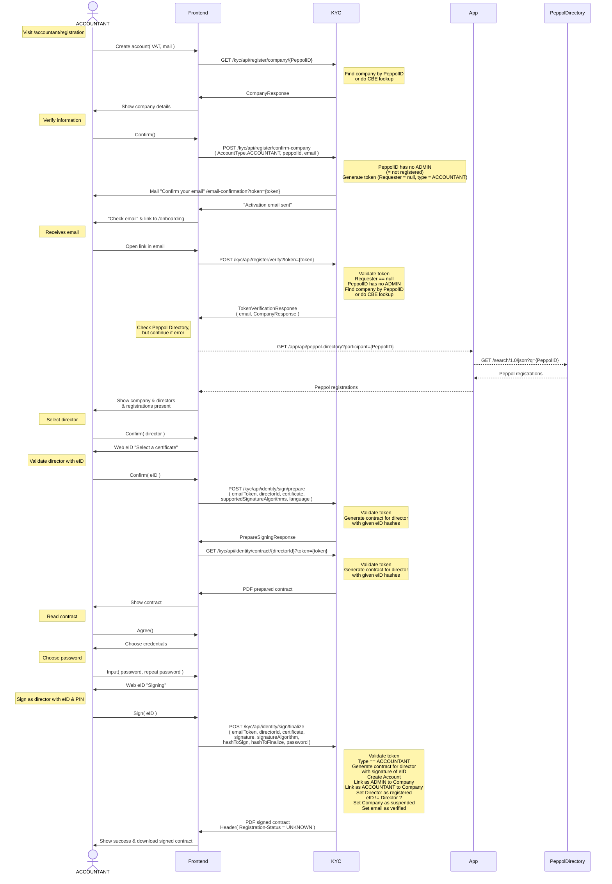

# Registration new ACCOUNTANT

```mermaid
sequenceDiagram
    actor ACCOUNTANT as ACCOUNTANT
    participant Frontend as Frontend
    participant KYC as KYC
    participant App as App
    participant PeppolDirectory as PeppolDirectory
    %%participant Proxy as Proxy%%
    %%participant Peppol as Peppol%%
    
    Note left of ACCOUNTANT: Visit /accountant/registration
    ACCOUNTANT ->> Frontend: Create account( VAT, mail )
    Frontend ->> KYC: GET /kyc/api/register/company/{PeppolID}
    Note right of KYC: Find company by PeppolID <br> or do CBE lookup
    KYC ->> Frontend: CompanyResponse
    Frontend ->> ACCOUNTANT: Show company details

    Note left of ACCOUNTANT: Verify information
    ACCOUNTANT ->> Frontend: Confirm()
    Frontend ->> KYC: POST /kyc/api/register/confirm-company <br> ( AccountType.ACCOUNTANT, peppolId, email )
    Note right of KYC: PeppolID has no ADMIN <br>(= not registered) <br> Generate token (Requester = null, type = ACCOUNTANT)
    KYC ->> ACCOUNTANT: Mail "Confirm your email" /email-confirmation?token={token}
    KYC ->> Frontend: "Activation email sent"
    Frontend ->> ACCOUNTANT: "Check email" & link to /onboarding

    Note left of ACCOUNTANT: Receives email
    ACCOUNTANT ->> Frontend: Open link in email
    Frontend ->> KYC: POST /kyc/api/register/verify?token={token}
    Note right of KYC: Validate token <br> Requester == null <br> PeppolID has no ADMIN <br> Find company by PeppolID <br> or do CBE lookup
    KYC ->> Frontend: TokenVerificationResponse <br> ( email, CompanyResponse )
    Note left of Frontend: Check Peppol Directory, <br> but continue if error
    Frontend -->> App: GET /app/api/peppol-directory?participant={PeppolID}
    App -->> PeppolDirectory: GET /search/1.0/json?q={PeppolID}
    PeppolDirectory -->> App: Peppol registrations
    App -->> Frontend: Peppol registrations
    Frontend ->> ACCOUNTANT: Show company & directors <br> & registrations present

    Note left of ACCOUNTANT: Select director
    ACCOUNTANT ->> Frontend: Confirm( director )
    Frontend ->> ACCOUNTANT: Web eID "Select a certificate"

    Note left of ACCOUNTANT: Validate director with eID
    ACCOUNTANT ->> Frontend: Confirm( eID )
    Frontend ->> KYC: POST /kyc/api/identity/sign/prepare <br> ( emailToken, directorId, certificate, <br> supportedSignatureAlgorithms, language )
    Note right of KYC: Validate token <br> Generate contract for director <br> with given eID hashes
    KYC ->> Frontend: PrepareSigningResponse
    Frontend ->> KYC: GET /kyc/api/identity/contract/{directorId}?token={token}
    Note right of KYC: Validate token <br> Generate contract for director <br> with given eID hashes
    KYC ->> Frontend: PDF prepared contract
    Frontend ->> ACCOUNTANT: Show contract

    Note left of ACCOUNTANT: Read contract
    ACCOUNTANT ->> Frontend: Agree()
    Frontend ->> ACCOUNTANT: Choose credentials

    Note left of ACCOUNTANT: Choose password
    ACCOUNTANT ->> Frontend: Input( password, repeat password )
    Frontend ->> ACCOUNTANT: Web eID "Signing"

    Note left of ACCOUNTANT: Sign as director with eID & PIN
    ACCOUNTANT ->> Frontend: Sign( eID )
    Frontend ->> KYC: POST /kyc/api/identity/sign/finalize <br> ( emailToken, directorId, certificate, <br> signature, signatureAlgorithm, <br> hashToSign, hashToFinalize, password )
    Note right of KYC: Validate token <br> Type == ACCOUNTANT <br> Generate contract for director <br> with signature of eID <br> Create Account <br> Link as ADMIN to Company <br> Link as ACCOUNTANT to Company <br> Set Director as registered <br> eID != Director ? <br> Set Company as suspended <br> Set email as verified
    KYC ->> Frontend: PDF signed contract <br> Header( Registration-Status = UNKNOWN )
    Frontend ->> ACCOUNTANT: Show success & download signed contract
```
