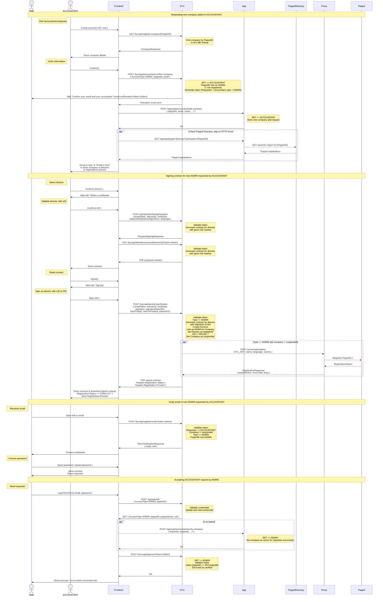

# Registration new ADMIN via ACCOUNTANT and sign before email verification

```mermaid
sequenceDiagram
    actor SME as SME
    actor ACCOUNTANT as ACCOUNTANT
    participant Frontend as Frontend
    participant KYC as KYC
    participant App as App
    participant PeppolDirectory as PeppolDirectory
    participant Proxy as Proxy
    participant Peppol as Peppol

Note over SME, Peppol: Requesting new company added to ACCOUNTANT
    Note left of ACCOUNTANT: Visit /accountant/companies
    ACCOUNTANT ->> Frontend: Create account( VAT, mail )
    Frontend ->> KYC: GET /kyc/api/register/company/{PeppolID}
    Note right of KYC: Find company by PeppolID <br> or do CBE lookup
    KYC ->> Frontend: CompanyResponse
    Frontend ->> ACCOUNTANT: Show company details

    Note left of ACCOUNTANT: Verify information
    ACCOUNTANT ->> Frontend: Confirm()
    Frontend ->> KYC: POST /kyc/sapi/accountant/confirm-company <br> ( AccountType.ADMIN, peppolId, email )
    Note right of KYC: JWT == ACCOUNTANT <br> PeppolID has no ADMIN <br>(= not registered) <br> Generate token (Requester = Accountant, type = ADMIN)
    KYC ->> SME: Mail "Confirm your email and your accountant" /email-confirmation?token={token}
    KYC ->> Frontend: "Activation email sent"
    Frontend ->> App: POST /app/sapi/accountant/add-company <br> ( peppolId, email, name, ...? )
    Note right of App: JWT == ACCOUNTANT <br> Store new company add request
    App ->> Frontend: OK
    opt Check Peppol Directory, skip on HTTP error
        Frontend -->> App: GET /app/api/peppol-directory?participant={PeppolID}
        App -->> PeppolDirectory: GET /search/1.0/json?q={PeppolID}
        PeppolDirectory -->> App: Peppol registrations
        App -->> Frontend: Peppol registrations
    end
    Frontend ->> ACCOUNTANT: Account new" & "Email is sent" <br> & Show company & directors <br> & registrations present

Note over SME, Peppol: Signing contract for new ADMIN requested by ACCOUNTANT
    Note left of ACCOUNTANT: Select director
    ACCOUNTANT ->> Frontend: Confirm( director )
    Frontend ->> ACCOUNTANT: Web eID "Select a certificate"

    Note left of ACCOUNTANT: Validate director with eID
    ACCOUNTANT ->> Frontend: Confirm( eID )
    Frontend ->> KYC: POST /kyc/api/identity/sign/prepare <br> ( emailToken, directorId, certificate, <br> supportedSignatureAlgorithms, language )
    Note right of KYC: Validate token <br> Generate contract for director <br> with given eID hashes
    KYC ->> Frontend: PrepareSigningResponse
    Frontend ->> KYC: GET /kyc/api/identity/contract/{directorId}?token={token}
    Note right of KYC: Validate token <br> Generate contract for director <br> with given eID hashes
    KYC ->> Frontend: PDF prepared contract
    Frontend ->> ACCOUNTANT: Show contract

    Note left of ACCOUNTANT: Read contract
    ACCOUNTANT ->> Frontend: Agree()
    Frontend ->> ACCOUNTANT: Web eID "Signing"

    Note left of ACCOUNTANT: Sign as director with eID & PIN
    ACCOUNTANT ->> Frontend: Sign( eID )
    Frontend ->> KYC: POST /kyc/api/identity/sign/finalize <br> ( emailToken, directorId, certificate, <br> signature, signatureAlgorithm, <br> hashToSign, hashToFinalize, password )
    Note right of KYC: Validate token <br> Type == ADMIN <br> Generate contract for director <br> with signature of eID <br> Create Account <br> Link as ADMIN to Company <br> Set Director as registered <br> eID != Director ? <br> Set Company as suspended
    opt Type == ADMIN && Company != suspended
        KYC -->> Proxy: POST /proxy/sapi/registry <br> KYC_JWT ( name, language, country )
        Proxy -->> Peppol: Register( PeppolID )
        Peppol -->> Proxy: RegistrationStatus
        Proxy -->> KYC: RegistrationResponse <br> ( peppolActive, errorCode, body )
    end
    KYC ->> Frontend: PDF signed contract <br> Header( Registration-Status ) <br> Header( Registration-Provider )
 %%   Frontend ->> App: POST /app/sapi/accountant/verify-company <br> ( requester, peppolId, ...? )
 %%   Note right of App: JWT == ADMIN <br> Set company as active for requester accountant
 %%   App ->> Frontend: OK
    Frontend ->> ACCOUNTANT: Show success & download signed contract <br> Registration-Status == CONFLICT ? <br> show Registration-Provider

Note over SME, Peppol: Verify email of new ADMIN requested by ACCOUNTANT
    Note left of SME: Receives email
    SME ->> Frontend: Open link in email
    Frontend ->> KYC: POST /kyc/api/register/verify?token={token}
    Note right of KYC: Validate token <br> Requester == ACCOUNTANT <br> Company != suspended <br> Type == ADMIN <br> PeppolID has ADMIN
    KYC ->> Frontend: TokenVerificationResponse <br> ( email, null )
    Frontend ->> SME: Choose credentials

    Note left of SME: Choose password
    SME ->> Frontend: Input( password, repeat password )
    Frontend ->> SME: Show success <br> Show requester

Note over SME, Peppol: Accepting ACCOUNTANT request by ADMIN
    Note left of SME: Read requester
    SME ->> Frontend: LoginToConfirm( email, password )
    Frontend ->> KYC: POST /api/jwt/auth <br> ( AccountType.ADMIN, peppolId )
    Note right of KYC: Validate credentials <br> Update last used ownership
    KYC ->> Frontend: JWT ( AccountType.ADMIN, peppolId, peppolActive, uid )
    opt if accepted
        Frontend -->> App: POST /app/sapi/accountant/verify-company <br> ( requester, peppolId, ...? )
        Note right of App: JWT == ADMIN <br> Set company as active for requester accountant
        App -->> Frontend: OK
    end
    Frontend ->> KYC: POST /kyc/sapi/approve?token={token}
    Note right of KYC: JWT == ADMIN <br> Validate token <br> token.peppolId == JWT.peppolId <br> Set email as verified
    KYC ->> Frontend: OK
    Frontend ->> SME: Show success / Go to active connection list
```
