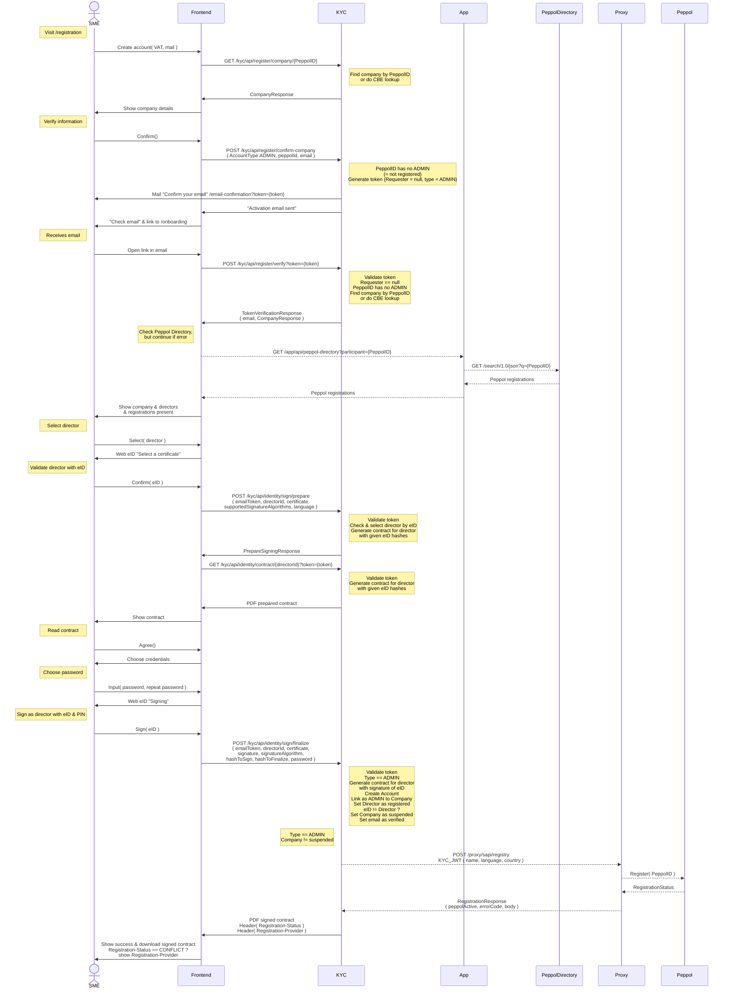

# Registration new ADMIN

```mermaid
sequenceDiagram
    actor SME as SME
    participant Frontend as Frontend
    participant KYC as KYC
    participant App as App
    participant PeppolDirectory as PeppolDirectory
    participant Proxy as Proxy
    participant Peppol as Peppol
    
    Note left of SME: Visit /registration
    SME ->> Frontend: Create account( VAT, mail )
    Frontend ->> KYC: GET /kyc/api/register/company/{PeppolID}
    Note right of KYC: Find company by PeppolID <br> or do CBE lookup
    KYC ->> Frontend: CompanyResponse
    Frontend ->> SME: Show company details

    Note left of SME: Verify information
    SME ->> Frontend: Confirm()
    Frontend ->> KYC: POST /kyc/api/register/confirm-company <br> ( AccountType.ADMIN, peppolId, email )
    Note right of KYC: PeppolID has no ADMIN <br>(= not registered) <br> Generate token (Requester = null, type = ADMIN)
    KYC ->> SME: Mail "Confirm your email" /email-confirmation?token={token}
    KYC ->> Frontend: "Activation email sent"
    Frontend ->> SME: "Check email" & link to /onboarding

    Note left of SME: Receives email
    SME ->> Frontend: Open link in email
    Frontend ->> KYC: POST /kyc/api/register/verify?token={token}
    Note right of KYC: Validate token <br> Requester == null <br> PeppolID has no ADMIN <br> Find company by PeppolID <br> or do CBE lookup
    KYC ->> Frontend: TokenVerificationResponse <br> ( email, CompanyResponse )
    Note left of Frontend: Check Peppol Directory, <br> but continue if error
    Frontend -->> App: GET /app/api/peppol-directory?participant={PeppolID}
    App -->> PeppolDirectory: GET /search/1.0/json?q={PeppolID}
    PeppolDirectory -->> App: Peppol registrations
    App -->> Frontend: Peppol registrations
    Frontend ->> SME: Show company & directors <br> & registrations present

    Note left of SME: Select director
    SME ->> Frontend: Select( director )
    Frontend ->> SME: Web eID "Select a certificate"

    Note left of SME: Validate director with eID
    SME ->> Frontend: Confirm( eID )
    Frontend ->> KYC: POST /kyc/api/identity/sign/prepare <br> ( emailToken, directorId, certificate, <br> supportedSignatureAlgorithms, language )
    Note right of KYC: Validate token <br> Check & select director by eID <br> Generate contract for director <br> with given eID hashes
    KYC ->> Frontend: PrepareSigningResponse
    Frontend ->> KYC: GET /kyc/api/identity/contract/{directorId}?token={token}
    Note right of KYC: Validate token <br> Generate contract for director <br> with given eID hashes
    KYC ->> Frontend: PDF prepared contract
    Frontend ->> SME: Show contract

    Note left of SME: Read contract
    SME ->> Frontend: Agree()
    Frontend ->> SME: Choose credentials

    Note left of SME: Choose password
    SME ->> Frontend: Input( password, repeat password )
    Frontend ->> SME: Web eID "Signing"

    Note left of SME: Sign as director with eID & PIN
    SME ->> Frontend: Sign( eID )
    Frontend ->> KYC: POST /kyc/api/identity/sign/finalize <br> ( emailToken, directorId, certificate, <br> signature, signatureAlgorithm, <br> hashToSign, hashToFinalize, password )
    Note right of KYC: Validate token <br> Type == ADMIN <br> Generate contract for director <br> with signature of eID <br> Create Account <br> Link as ADMIN to Company <br> Set Director as registered <br> eID != Director ? <br> Set Company as suspended <br> Set email as verified
    Note left of KYC: Type == ADMIN <br> Company != suspended
    KYC -->> Proxy: POST /proxy/sapi/registry <br> KYC_JWT ( name, language, country )
    Proxy -->> Peppol: Register( PeppolID )
    Peppol -->> Proxy: RegistrationStatus
    Proxy -->> KYC: RegistrationResponse <br> ( peppolActive, errorCode, body )
    KYC ->> Frontend: PDF signed contract <br> Header( Registration-Status ) <br> Header( Registration-Provider )
    Frontend ->> SME: Show success & download signed contract <br> Registration-Status == CONFLICT ? <br> show Registration-Provider
```
