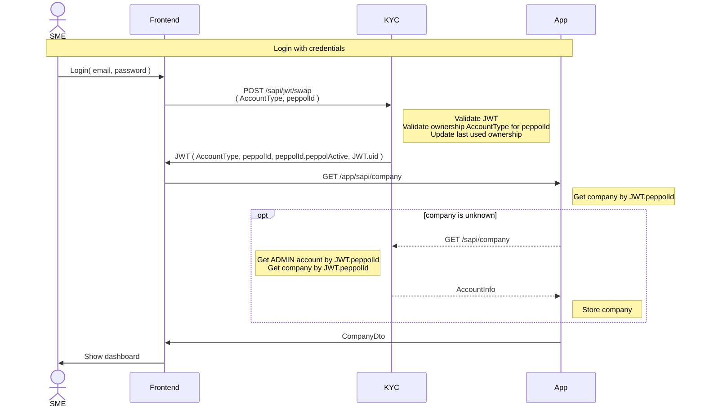

# Swap

```mermaid
sequenceDiagram
    actor SME as SME
    participant Frontend as Frontend
    participant KYC as KYC
    participant App as App
    %%participant PeppolDirectory as PeppolDirectory
    %%participant Proxy as Proxy
    %%participant Peppol as Peppol

Note over SME, App: Login with credentials
    SME ->> Frontend: Login( email, password )
    Frontend ->> KYC: POST /sapi/jwt/swap <br> ( AccountType, peppolId )
    Note right of KYC: Validate JWT <br> Validate ownership AccountType for peppolId <br> Update last used ownership
    KYC ->> Frontend: JWT ( AccountType, peppolId, peppolId.peppolActive, JWT.uid )
    Frontend ->> App: GET /app/sapi/company
    Note right of App: Get company by JWT.peppolId
    opt company is unknown
        App -->> KYC: GET /sapi/company
        Note left of KYC: Get ADMIN account by JWT.peppolId <br> Get company by JWT.peppolId 
        KYC -->> App: AccountInfo
        Note right of App: Store company
    end
    App ->> Frontend: CompanyDto
    Frontend ->> SME: Show dashboard
```
