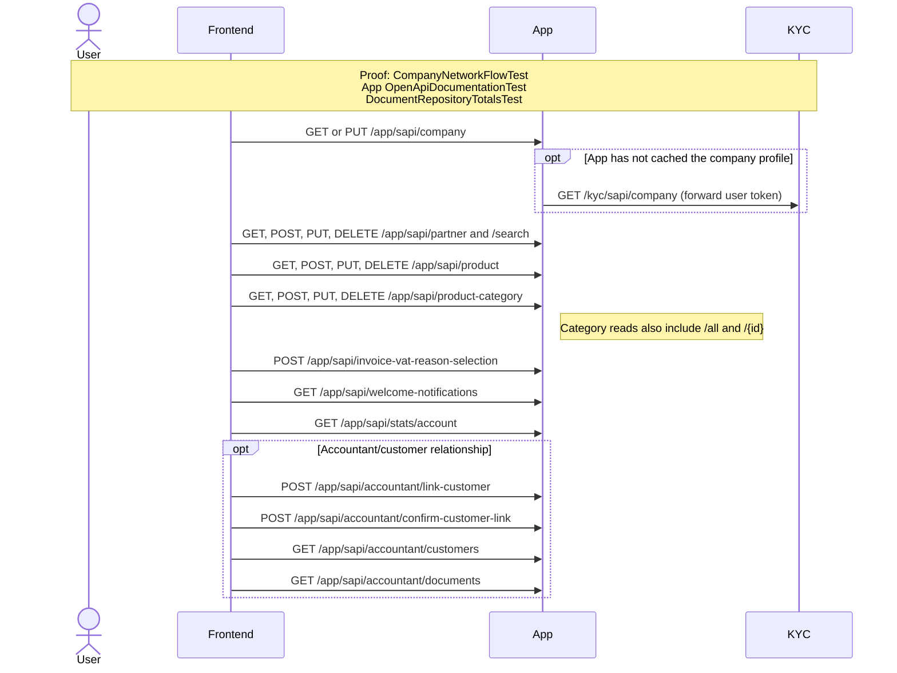

# Application profile and master data

This flow groups authenticated company profile, partner, product, product-category, VAT reason,
welcome notification, account-statistics, and accountant/customer APIs.

Executable proof: [`CompanyNetworkFlowTest`](../app/backend/src/test/java/org/letspeppol/app/service/CompanyNetworkFlowTest.java) proves the profile cache-miss and user-token forwarding branch. [`OpenApiDocumentationTest`](../app/backend/src/test/java/org/letspeppol/app/OpenApiDocumentationTest.java) validates complete route/description coverage; repository behavior is covered by the App test suite.

Master-data route coverage: `/app/sapi/partner/search`, `/app/sapi/partner/{id}`,
`/app/sapi/product/{id}`, `/app/sapi/product-category/all`, and
`/app/sapi/product-category/{id}` are the item/search variants represented by the grouped arrows.

Return to the [API network flow guide](./api-network-flows.md).
