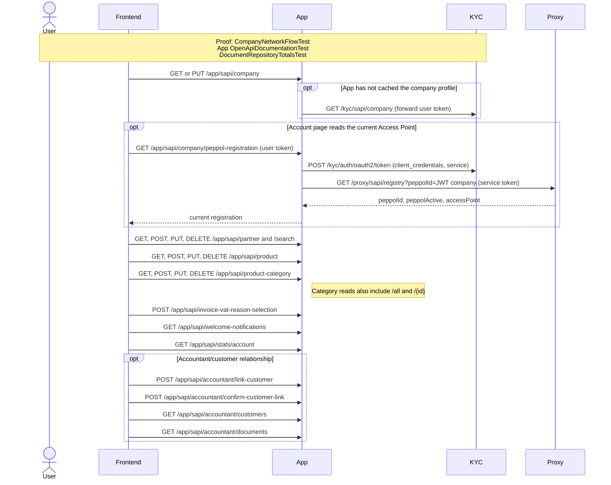

# Application profile and master data

This flow groups authenticated company profile, partner, product, product-category, VAT reason,
welcome notification, account-statistics, and accountant/customer APIs.

Executable proof: [`CompanyNetworkFlowTest`](../app/backend/src/test/java/org/letspeppol/app/service/CompanyNetworkFlowTest.java) proves the profile cache-miss and user-token forwarding branch. [`OpenApiDocumentationTest`](../app/backend/src/test/java/org/letspeppol/app/OpenApiDocumentationTest.java) validates complete route/description coverage; repository behavior is covered by the App test suite.

[`PeppolRegistrationNetworkFlowTest`](../app/backend/src/test/java/org/letspeppol/app/service/PeppolRegistrationNetworkFlowTest.java) proves the company Access Point lookup, service authentication, and missing-registration versus proxy-failure behavior.

```mermaid
sequenceDiagram
    actor User
    participant UI as Frontend
    participant App
    participant KYC
    participant Proxy

    Note over User,KYC: Proof: CompanyNetworkFlowTest<br/>App OpenApiDocumentationTest<br/>DocumentRepositoryTotalsTest
    UI->>App: GET or PUT /app/sapi/company
    opt App has not cached the company profile
        App->>KYC: GET /kyc/sapi/company (forward user token)
    end
    opt Account page reads the current Access Point
        UI->>App: GET /app/sapi/company/peppol-registration (user token)
        App->>KYC: POST /kyc/auth/oauth2/token (client_credentials, service)
        App->>Proxy: GET /proxy/sapi/registry?peppolId=JWT company (service token)
        Proxy-->>App: peppolId, peppolActive, accessPoint
        App-->>UI: current registration
    end
    UI->>App: GET, POST, PUT, DELETE /app/sapi/partner and /search
    UI->>App: GET, POST, PUT, DELETE /app/sapi/product
    UI->>App: GET, POST, PUT, DELETE /app/sapi/product-category
    Note right of App: Category reads also include /all and /{id}
    UI->>App: POST /app/sapi/invoice-vat-reason-selection
    UI->>App: GET /app/sapi/welcome-notifications
    UI->>App: GET /app/sapi/stats/account
    opt Accountant/customer relationship
        UI->>App: POST /app/sapi/accountant/link-customer
        UI->>App: POST /app/sapi/accountant/confirm-customer-link
        UI->>App: GET /app/sapi/accountant/customers
        UI->>App: GET /app/sapi/accountant/documents
    end
```

Master-data route coverage: `/app/sapi/partner/search`, `/app/sapi/partner/{id}`,
`/app/sapi/product/{id}`, `/app/sapi/product-category/all`, and
`/app/sapi/product-category/{id}` are the item/search variants represented by the grouped arrows.

The Access Point is read from the proxy's stored company registry, independently of the company
profile loaded at login. The app derives the Peppol ID from the authenticated JWT. No provider
field is stored in App or KYC. A missing registry entry returns inactive registration with
`accessPoint: NONE`; proxy failures return 503 and the Account page shows that the provider is
unavailable. The page refreshes the lookup after registration and unregistration.

Return to the [API network flow guide](./api-network-flows.md).
