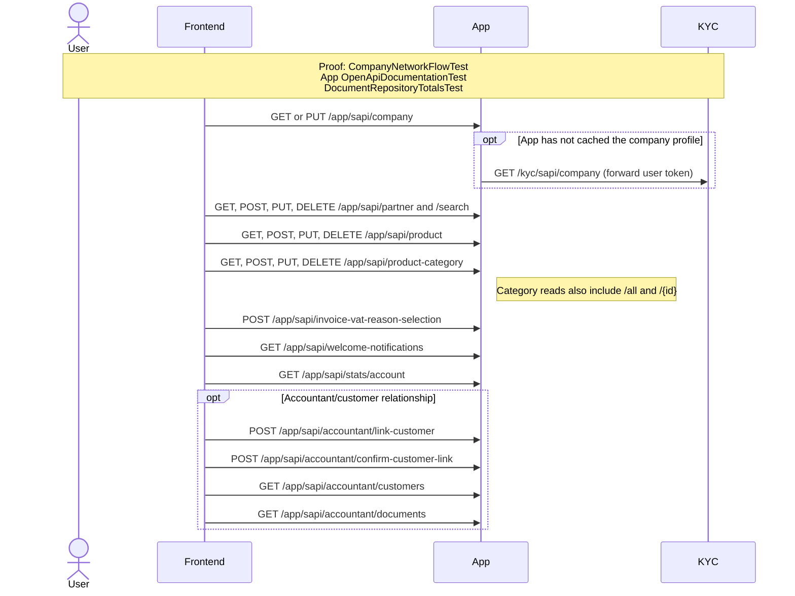

# Application profile and master data

This flow groups authenticated company profile, partner, product, product-category, VAT reason,
welcome notification, account-statistics, and accountant/customer APIs.

Executable proof: [`CompanyNetworkFlowTest`](../app/backend/src/test/java/org/letspeppol/app/service/CompanyNetworkFlowTest.java) proves the profile cache-miss and user-token forwarding branch. [`OpenApiDocumentationTest`](../app/backend/src/test/java/org/letspeppol/app/OpenApiDocumentationTest.java) validates complete route/description coverage; repository behavior is covered by the App test suite.

```mermaid
sequenceDiagram
    actor User
    participant UI as Frontend
    participant App
    participant KYC

    Note over User,KYC: Proof: CompanyNetworkFlowTest<br/>App OpenApiDocumentationTest<br/>DocumentRepositoryTotalsTest
    UI->>App: GET or PUT /app/sapi/company
    opt App has not cached the company profile
        App->>KYC: GET /kyc/sapi/company (forward user token)
    end
    UI->>App: GET, POST, PUT, DELETE /app/sapi/partner and /search
    UI->>App: GET, POST, PUT, DELETE /app/sapi/product
    UI->>App: GET, POST, PUT, DELETE /app/sapi/product-category
    Note right of App: Category reads also include /all and /{id}
    UI->>App: POST /app/sapi/invoice-vat-reason-selection
    UI->>App: GET /app/sapi/welcome-notifications
    UI->>App: GET /app/sapi/stats/account
    opt Accountant/customer relationship
        UI->>App: POST /app/sapi/accountant/link-customer
        UI->>App: POST /app/sapi/accountant/confirm-customer-link
        UI->>App: GET /app/sapi/accountant/customers
        UI->>App: GET /app/sapi/accountant/documents
    end
```

Master-data route coverage: `/app/sapi/partner/search`, `/app/sapi/partner/{id}`,
`/app/sapi/product/{id}`, `/app/sapi/product-category/all`, and
`/app/sapi/product-category/{id}` are the item/search variants represented by the grouped arrows.

## Permissions

The routes above follow the same `permissionMask` rules as the
[document lifecycle](./api-document-lifecycle.md#permissions).

| Rule | Routes |
|---|---|
| Any member of the company | `GET /app/sapi/company`, `GET /app/sapi/welcome-notifications`, `GET /app/sapi/accountant/customers`, `GET /app/sapi/accountant/documents` |
| `COMPANY_SETTINGS` (128) | `PUT /app/sapi/company`; switching email notifications on or off also needs the `ADMIN` |
| `INVOICE_READ` (1) | `GET /app/sapi/stats/account` |
| `INVOICE_READ` (1) or `PARTNER_MANAGE` (32) | `GET /app/sapi/partner`, `/search` |
| `PARTNER_MANAGE` (32) | `POST`, `PUT`, `DELETE /app/sapi/partner` |
| `INVOICE_READ` (1) or `PRODUCT_MANAGE` (64) | `GET /app/sapi/product`, `GET /app/sapi/product-category`, `/all`, `/{id}` |
| `PRODUCT_MANAGE` (64) | `POST`, `PUT`, `DELETE /app/sapi/product` and `/app/sapi/product-category` |
| `INVOICE_DRAFT` (2) | `POST /app/sapi/invoice-vat-reason-selection` |
| `ADMIN` only | `POST /app/sapi/accountant/link-customer`, `POST /app/sapi/accountant/confirm-customer-link`, `POST /app/sapi/sponsors` |

Return to the [API network flow guide](./api-network-flows.md).
