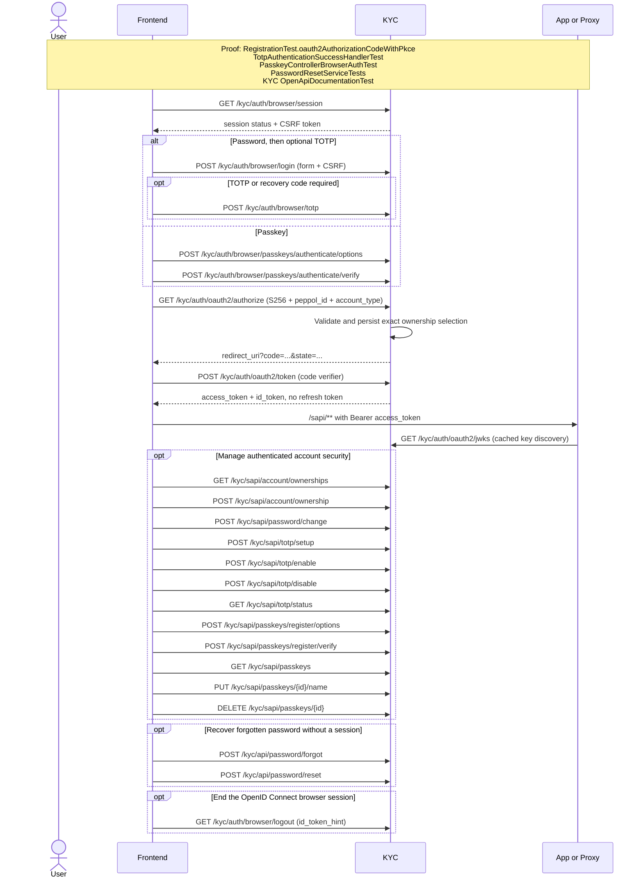

# Browser authentication, OAuth2, and account security

This flow covers browser session discovery, password/TOTP and passkey login, OAuth2 Authorization
Code with PKCE, JWT validation by downstream APIs, account ownership selection, and security-factor
management.

Executable proof: [`RegistrationTest`](../kyc/src/test/java/org/letspeppol/kyc/controller/RegistrationTest.java), method `oauth2AuthorizationCodeWithPkce`, plus the focused TOTP, passkey, password-reset, and OpenAPI documentation tests referenced in the diagram.

`POST /kyc/sapi/account/ownership` records `lastUsed` only as a future default. The new company/role
claims come from the explicit ownership selector on the PKCE authorization request. KYC stores that
selector with the authorization code and revalidates it at exchange, so another tab changing
`lastUsed` cannot alter the resulting token; see [Swap](./swap.md).

OAuth2 and OpenID Connect discovery remain at their standardized, issuer-derived
`/.well-known/**` locations rather than moving under `/auth/**`; the public KYC reverse proxy must
continue routing those locations to the authorization server. Their metadata advertises the grouped
authorization, token, JWKS, UserInfo, and logout endpoints.

Return to the [API network flow guide](./api-network-flows.md).
