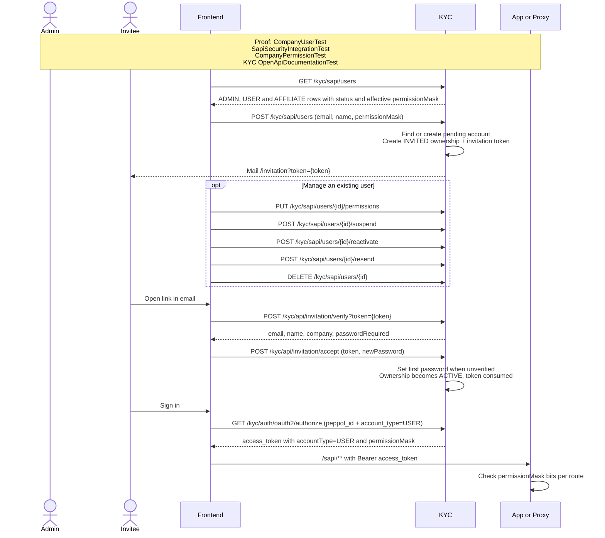

# Company users, invitations, and permissions

This flow covers how the ADMIN of a company invites additional users, manages their status and
permission mask, and how an invited person accepts the invitation. Only the ADMIN, verified against
the database on every call, can reach the `/kyc/sapi/users` routes; the invitation routes are public
and protected by the single-use token mailed to the invitee.

Executable proof: [`CompanyUserTest`](../kyc/src/test/java/org/letspeppol/kyc/controller/CompanyUserTest.java) proves every route below; [`SapiSecurityIntegrationTest`](../kyc/src/test/java/org/letspeppol/kyc/config/SapiSecurityIntegrationTest.java) proves the ADMIN-only boundary and [`CompanyPermissionTest`](../kyc/src/test/java/org/letspeppol/kyc/model/CompanyPermissionTest.java) the permission bits.

## Permission mask

A user's permissions are one integer stored on the ownership and copied into the `permissionMask`
claim of the access token. Bits are append-only.

| Bit | Name | Grants |
| --- | --- | --- |
| 1 | `INVOICE_READ` | List, open and render documents; dashboard totals |
| 2 | `INVOICE_DRAFT` | Create, edit, validate and delete drafts |
| 4 | `INVOICE_SEND` | Send, schedule, reschedule, cancel |
| 8 | `INVOICE_STATUS` | Mark read, paid, error seen |
| 16 | `INVOICE_EXPORT` | Bulk download jobs |
| 32 | `PARTNER_MANAGE` | Create, edit, delete partners |
| 64 | `PRODUCT_MANAGE` | Products and categories |
| 128 | `COMPANY_SETTINGS` | Company profile, IBAN/BIC, payment terms |

KYC normalises every mask it stores or emits: `INVOICE_SEND` implies `INVOICE_DRAFT`, and
`INVOICE_DRAFT`, `INVOICE_STATUS` and `INVOICE_EXPORT` imply `INVOICE_READ`. A mask with unknown or
negative bits is rejected with `invalid_permission_mask`. `USER` and `AFFILIATE` ownerships use the
stored mask; `ADMIN` and `APP` tokens always carry all bits.

An `AFFILIATE` ownership is created by the affiliate registration with all bits set. The ADMIN can
change its mask and suspend or reactivate it like a `USER`. It cannot be invited or removed here.

## Status and errors

An ownership is `INVITED` until the invitation is accepted, `ACTIVE` afterwards, and `SUSPENDED`
while the ADMIN has suspended it. Only `ACTIVE` ownerships are listed by
`/kyc/sapi/account/ownerships` and can obtain a token, so a suspension or removal takes effect at the
next token renewal (at most one hour later).

An `INVITED` row shows the name the ADMIN typed, also when the email address already has an account;
the account's own name appears once the invitation is accepted. KYC stores the invitation first and
mails it afterwards. When the mail cannot be sent the row stays `INVITED` and the call answers
`invitation_not_sent`, so the ADMIN can use `resend`. Invitation mails have their own rate limit per
company and email address, separate from registration mails.

| Situation | Status | `errorCode` |
| --- | --- | --- |
| Caller is not the active ADMIN of the company | 403 | `not_admin` |
| Invited email is already a member of the company | 400 | `user_already_member` |
| Unknown id, or id of another company | 404 | `user_not_found` |
| Row is the `ADMIN`, an `AFFILIATE` row on remove or resend, or not in the state the action needs | 400 | `user_not_editable` |
| Mask has unknown or negative bits | 400 | `invalid_permission_mask` |
| Invitation stored, but the mail could not be sent | 400 | `invitation_not_sent` |
| Too many invitation mails from this company to this address | 429 | `too_many_requests` |
| Token unknown or already used | 400 | `invitation_not_found` |
| Token expired | 400 | `invitation_expired` |
| First password missing or too short | 400 | `invalid_password` |

`POST /kyc/sapi/linked/request-company` is limited to `ADMIN` and `AFFILIATE` tokens, so a `USER`
cannot start a registration for another company.

Return to the [API network flow guide](./api-network-flows.md).
