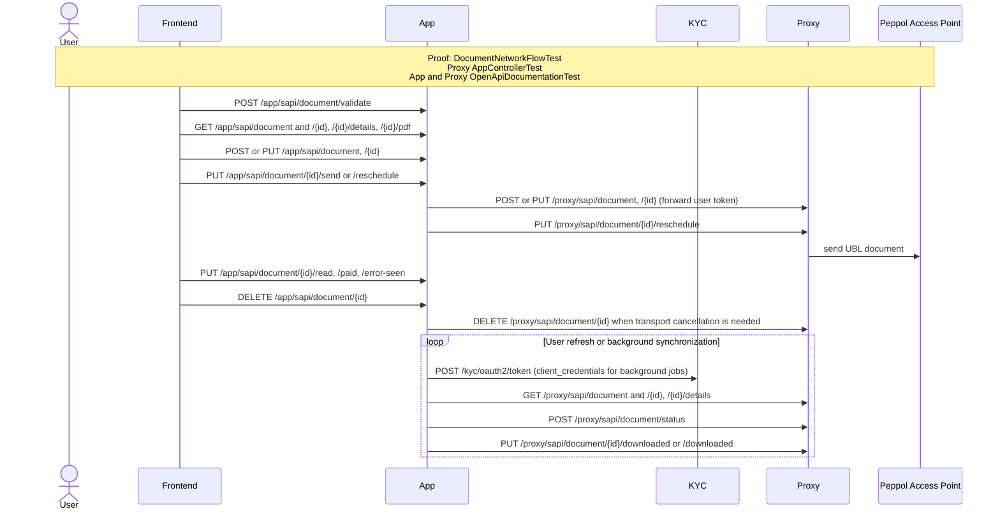

# Business-document lifecycle and Peppol transport

This flow follows a business document from validation and local persistence through Proxy transport,
status synchronization, download acknowledgement, cancellation, and user-visible state changes.

Executable proof: [`DocumentNetworkFlowTest`](../app/backend/src/test/java/org/letspeppol/app/service/DocumentNetworkFlowTest.java) covers App-to-Proxy calls, while [`AppControllerTest`](../proxy/src/test/java/org/letspeppol/proxy/controller/AppControllerTest.java) covers Proxy's acting-user validation. OpenAPI documentation tests guard every route in the grouped notes.

Document route coverage: the grouped App reads and actions include
`/app/sapi/document/{id}/details`, `/app/sapi/document/{id}/pdf`,
`/app/sapi/document/{id}/reschedule`, `/app/sapi/document/{id}/paid`, and
`/app/sapi/document/{id}/error-seen`. Proxy polling includes
`/proxy/sapi/document/{id}/details` and the batch acknowledgement route
`/proxy/sapi/document/downloaded`.

Return to the [API network flow guide](./api-network-flows.md).
