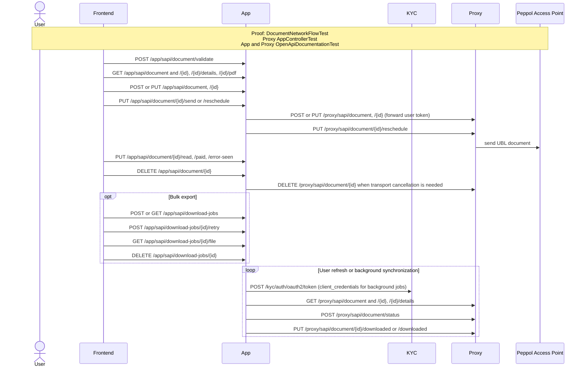

# Business-document lifecycle and Peppol transport

This flow follows a business document from validation and local persistence through Proxy transport,
status synchronization, download acknowledgement, cancellation, and user-visible state changes.

Executable proof: [`DocumentNetworkFlowTest`](../app/backend/src/test/java/org/letspeppol/app/service/DocumentNetworkFlowTest.java) covers App-to-Proxy calls, while [`AppControllerTest`](../proxy/src/test/java/org/letspeppol/proxy/controller/AppControllerTest.java) covers Proxy's acting-user validation. OpenAPI documentation tests guard every route in the grouped notes.

```mermaid
sequenceDiagram
    actor User
    participant UI as Frontend
    participant App
    participant KYC
    participant Proxy
    participant AP as Peppol Access Point

    Note over User,AP: Proof: DocumentNetworkFlowTest<br/>Proxy AppControllerTest<br/>App and Proxy OpenApiDocumentationTest
    UI->>App: POST /app/sapi/document/validate
    UI->>App: GET /app/sapi/document and /{id}, /{id}/details, /{id}/pdf
    UI->>App: POST or PUT /app/sapi/document, /{id}
    UI->>App: PUT /app/sapi/document/{id}/send or /reschedule
    App->>Proxy: POST or PUT /proxy/sapi/document, /{id} (forward user token)
    App->>Proxy: PUT /proxy/sapi/document/{id}/reschedule
    Proxy->>AP: send UBL document
    UI->>App: PUT /app/sapi/document/{id}/read, /paid, /error-seen
    UI->>App: DELETE /app/sapi/document/{id}
    App->>Proxy: DELETE /proxy/sapi/document/{id} when transport cancellation is needed
    opt Bulk export
        UI->>App: POST or GET /app/sapi/download-jobs
        UI->>App: POST /app/sapi/download-jobs/{id}/retry
        UI->>App: GET /app/sapi/download-jobs/{id}/file
        UI->>App: DELETE /app/sapi/download-jobs/{id}
    end
    loop User refresh or background synchronization
        App->>KYC: POST /kyc/auth/oauth2/token (client_credentials for background jobs)
        App->>Proxy: GET /proxy/sapi/document and /{id}, /{id}/details
        App->>Proxy: POST /proxy/sapi/document/status
        App->>Proxy: PUT /proxy/sapi/document/{id}/downloaded or /downloaded
    end
```

Document route coverage: the grouped App reads and actions include
`/app/sapi/document/{id}/details`, `/app/sapi/document/{id}/pdf`,
`/app/sapi/document/{id}/reschedule`, `/app/sapi/document/{id}/paid`, and
`/app/sapi/document/{id}/error-seen`. Proxy polling includes
`/proxy/sapi/document/{id}/details` and the batch acknowledgement route
`/proxy/sapi/document/downloaded`.

## Permissions

Every route needs the company permission below. KYC puts the caller's permissions in the access token
as one integer, `permissionMask`, with one bit per permission; App and Proxy turn each set bit into an
authority. A token without the claim gets what its `accountType` stands for: nothing for `USER`, read
and draft for `USER_DRAFT`, read for `USER_READ`, and full access for every other type. A refused call
answers `403` with `{"errorCode":"MISSING_PERMISSION"}`.

Executable proof: [`SapiPermissionCoverageTest`](../app/backend/src/test/java/org/letspeppol/app/config/SapiPermissionCoverageTest.java) pins the rule of every App route, [`SapiPermissionIntegrationTest`](../app/backend/src/test/java/org/letspeppol/app/config/SapiPermissionIntegrationTest.java) exercises them over HTTP, and [`AppControllerPermissionTest`](../proxy/src/test/java/org/letspeppol/proxy/controller/AppControllerPermissionTest.java) does both for Proxy.

| Permission (bit) | App routes | Proxy routes |
|---|---|---|
| `INVOICE_READ` (1) | `GET /app/sapi/document`, `/{id}`, `/{id}/details`, `/{id}/pdf` | `GET /proxy/sapi/document`, `/{id}`, `/{id}/details`, `POST /status`, `PUT /{id}/downloaded`, `PUT /downloaded` |
| `INVOICE_DRAFT` (2) | `POST /app/sapi/document/validate`, `POST` or `PUT /app/sapi/document` with `draft=true`, `DELETE /app/sapi/document/{id}` for a draft | none |
| `INVOICE_SEND` (4) | `POST` or `PUT /app/sapi/document` with `draft=false`, `PUT /{id}/send`, `PUT /{id}/reschedule` | `POST` or `PUT /proxy/sapi/document`, `PUT /{id}/reschedule`, `DELETE /{id}` |
| `INVOICE_STATUS` (8) | `PUT /app/sapi/document/{id}/read`, `/paid`, `/error-seen` | none |
| `INVOICE_EXPORT` (16) | every `/app/sapi/download-jobs` route | none |

`INVOICE_DRAFT` alone only reaches drafts: updating a document that is no longer a draft also needs
`INVOICE_SEND`, and deleting one is reserved for the company's `ADMIN`. App only synchronizes with
Proxy on behalf of a caller that holds `INVOICE_READ`.

Return to the [API network flow guide](./api-network-flows.md).
