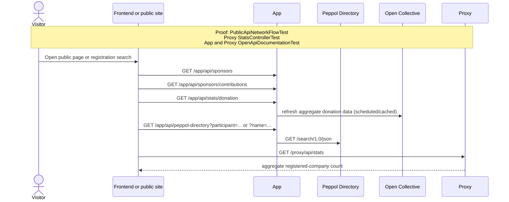

# Public discovery and aggregate statistics

This flow groups unauthenticated discovery and aggregate-statistics APIs. App caches or refreshes
third-party aggregate data; Proxy exposes its own registered-company count.

Executable proof: [`PublicApiNetworkFlowTest`](../app/backend/src/test/java/org/letspeppol/app/service/PublicApiNetworkFlowTest.java) proves Peppol Directory and Proxy aggregate calls, and [`StatsControllerTest`](../proxy/src/test/java/org/letspeppol/proxy/controller/StatsControllerTest.java) proves the public Proxy result. The App and Proxy OpenAPI tests validate route coverage.

Return to the [API network flow guide](./api-network-flows.md).
