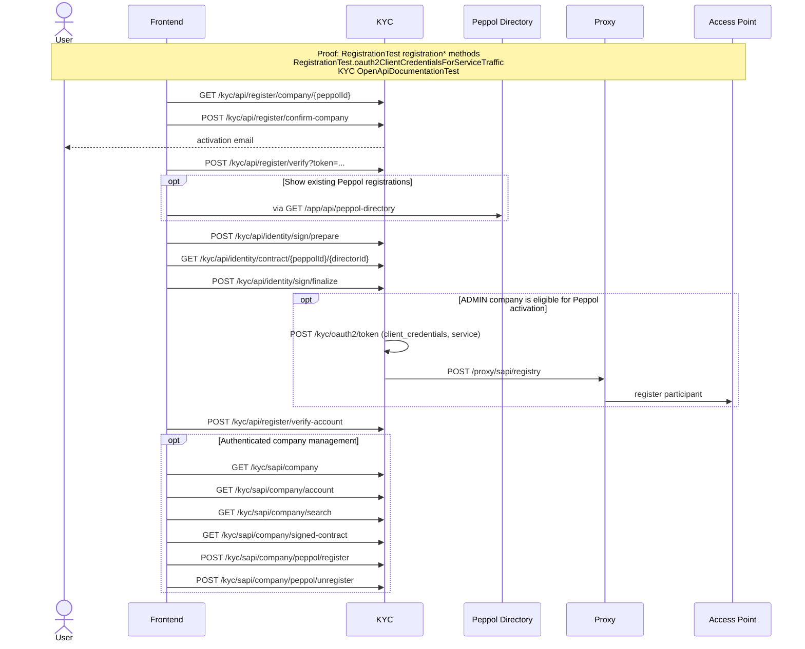

# Registration, identity signing, and company activation

The detailed registration variants are grouped in [KYC and registration flows](./kyc.md). This page
shows their shared public onboarding, identity signing, account verification, and service-only
registry traffic.

Executable proof: [`RegistrationTest`](../kyc/src/test/java/org/letspeppol/kyc/controller/RegistrationTest.java) exercises every variant, the service token, and the downstream registry call; [`OpenApiDocumentationTest`](../kyc/src/test/java/org/letspeppol/kyc/OpenApiDocumentationTest.java) keeps the endpoint catalogue aligned.

An affiliate-originated request uses `POST /kyc/sapi/linked/request-company`. The verification
response includes its requester, but there is currently no affiliate approval mutation API; the
older diagrams' nonexistent `/app/sapi/affiliate/**` calls have therefore been removed.

Return to the [API network flow guide](./api-network-flows.md).
