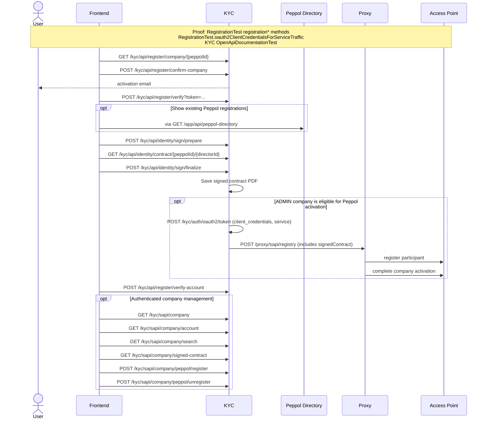

# Registration, identity signing, and company activation

The detailed registration variants are grouped in [KYC and registration flows](./kyc.md). This page
shows their shared public onboarding, identity signing, account verification, and service-only
registry traffic.

Executable proof: [`RegistrationTest`](../kyc/src/test/java/org/letspeppol/kyc/controller/RegistrationTest.java) exercises every variant, the service token, and the downstream registry call; [`OpenApiDocumentationTest`](../kyc/src/test/java/org/letspeppol/kyc/OpenApiDocumentationTest.java) keeps the endpoint catalogue aligned.

```mermaid
sequenceDiagram
    actor User
    participant UI as Frontend
    participant KYC
    participant Directory as Peppol Directory
    participant Proxy
    participant AP as Access Point

    Note over User,AP: Proof: RegistrationTest registration* methods<br/>RegistrationTest.oauth2ClientCredentialsForServiceTraffic<br/>KYC OpenApiDocumentationTest
    UI->>KYC: GET /kyc/api/register/company/{peppolId}
    UI->>KYC: POST /kyc/api/register/confirm-company
    KYC-->>User: activation email
    UI->>KYC: POST /kyc/api/register/verify?token=...
    opt Show existing Peppol registrations
        UI->>Directory: via GET /app/api/peppol-directory
    end
    UI->>KYC: POST /kyc/api/identity/sign/prepare
    UI->>KYC: GET /kyc/api/identity/contract/{peppolId}/{directorId}
    UI->>KYC: POST /kyc/api/identity/sign/finalize
    KYC->>KYC: Save signed contract PDF
    opt ADMIN company is eligible for Peppol activation
        KYC->>KYC: POST /kyc/auth/oauth2/token (client_credentials, service)
        KYC->>Proxy: POST /proxy/sapi/registry (includes signedContract)
        Proxy->>AP: register participant
        Proxy->>AP: complete company activation
    end
    UI->>KYC: POST /kyc/api/register/verify-account
    opt Authenticated company management
        UI->>KYC: GET /kyc/sapi/company
        UI->>KYC: GET /kyc/sapi/company/account
        UI->>KYC: GET /kyc/sapi/company/search
        UI->>KYC: GET /kyc/sapi/company/signed-contract
        UI->>KYC: POST /kyc/sapi/company/peppol/register
        UI->>KYC: POST /kyc/sapi/company/peppol/unregister
    end
```

An affiliate-originated request uses `POST /kyc/sapi/linked/request-company`. The verification
response includes its requester, but there is currently no affiliate approval mutation API; the
older diagrams' nonexistent `/app/sapi/affiliate/**` calls have therefore been removed.

KYC saves the signed PDF under `CONTRACT_DATA_DIR/contracts` before requesting registration.
The service-only registry request carries it as the Base64-encoded JSON field `signedContract`.
Later activation attempts reload the company's ADMIN contract from the same storage.
Registration is successful only after the access point confirms company activation.
If activation fails, the proxy attempts to delete the newly created company so registration
can be retried. Failed cleanup is logged; the signed contract remains available in KYC.

Executable proof: [`CompanyRegistrationContractTest`](../kyc/src/test/java/org/letspeppol/kyc/service/CompanyRegistrationContractTest.java)
checks contract forwarding and retention after failure;
[`RecommandServiceTest`](../proxy/src/test/java/org/letspeppol/proxy/service/RecommandServiceTest.java)
checks company activation, response handling, and cleanup on failure.

Return to the [API network flow guide](./api-network-flows.md).
