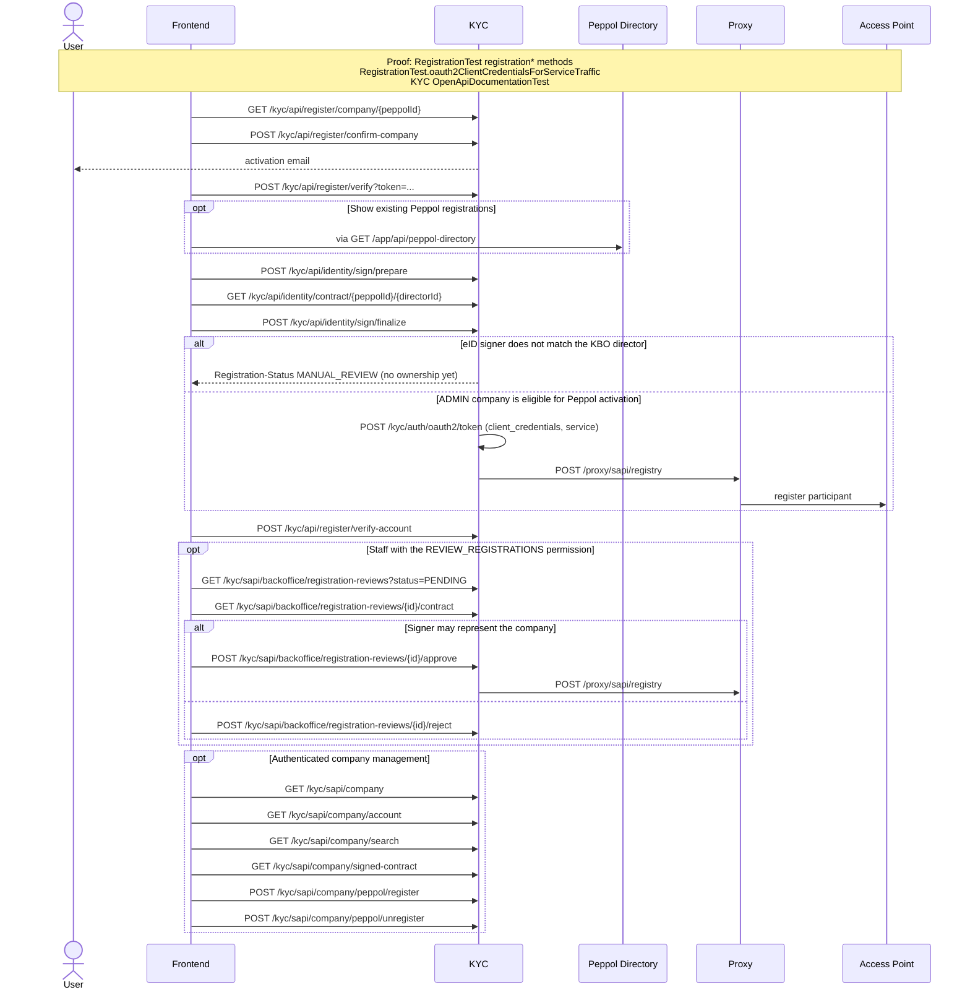

# Registration, identity signing, and company activation

The detailed registration variants are grouped in [KYC and registration flows](./kyc.md). This page
shows their shared public onboarding, identity signing, account verification, and service-only
registry traffic.

Executable proof: [`RegistrationTest`](../kyc/src/test/java/org/letspeppol/kyc/controller/RegistrationTest.java) exercises every variant, the service token, and the downstream registry call; [`OpenApiDocumentationTest`](../kyc/src/test/java/org/letspeppol/kyc/OpenApiDocumentationTest.java) keeps the endpoint catalogue aligned.

```mermaid
sequenceDiagram
    actor User
    participant UI as Frontend
    participant KYC
    participant Directory as Peppol Directory
    participant Proxy
    participant AP as Access Point

    Note over User,AP: Proof: RegistrationTest registration* methods<br/>RegistrationTest.oauth2ClientCredentialsForServiceTraffic<br/>KYC OpenApiDocumentationTest
    UI->>KYC: GET /kyc/api/register/company/{peppolId}
    UI->>KYC: POST /kyc/api/register/confirm-company
    KYC-->>User: activation email
    UI->>KYC: POST /kyc/api/register/verify?token=...
    opt Show existing Peppol registrations
        UI->>Directory: via GET /app/api/peppol-directory
    end
    UI->>KYC: POST /kyc/api/identity/sign/prepare
    UI->>KYC: GET /kyc/api/identity/contract/{peppolId}/{directorId}
    UI->>KYC: POST /kyc/api/identity/sign/finalize
    alt eID signer does not match the KBO director
        KYC-->>UI: Registration-Status MANUAL_REVIEW (no ownership yet)
    else ADMIN company is eligible for Peppol activation
        KYC->>KYC: POST /kyc/auth/oauth2/token (client_credentials, service)
        KYC->>Proxy: POST /proxy/sapi/registry
        Proxy->>AP: register participant
    end
    UI->>KYC: POST /kyc/api/register/verify-account
    opt Staff with the REVIEW_REGISTRATIONS permission
        UI->>KYC: GET /kyc/sapi/backoffice/registration-reviews?status=PENDING
        UI->>KYC: GET /kyc/sapi/backoffice/registration-reviews/{id}/contract
        alt Signer may represent the company
            UI->>KYC: POST /kyc/sapi/backoffice/registration-reviews/{id}/approve
            KYC->>Proxy: POST /proxy/sapi/registry
        else
            UI->>KYC: POST /kyc/sapi/backoffice/registration-reviews/{id}/reject
        end
    end
    opt Authenticated company management
        UI->>KYC: GET /kyc/sapi/company
        UI->>KYC: GET /kyc/sapi/company/account
        UI->>KYC: GET /kyc/sapi/company/search
        UI->>KYC: GET /kyc/sapi/company/signed-contract
        UI->>KYC: POST /kyc/sapi/company/peppol/register
        UI->>KYC: POST /kyc/sapi/company/peppol/unregister
    end
```

An affiliate-originated request uses `POST /kyc/sapi/linked/request-company`. The verification
response includes its requester, but there is currently no affiliate approval mutation API; the
older diagrams' nonexistent `/app/sapi/affiliate/**` calls have therefore been removed.

When the name on the eID does not match the director listed in the KBO, finalize stores the
signature with review status `PENDING` and creates no ownership, so the signer cannot log in yet
(login reports `ownership_pending_review`, or `ownership_review_rejected` after a rejection). Accounts
holding the `REVIEW_REGISTRATIONS` permission (table `account_permission`) see these reviews in the
backoffice at `/backoffice`; its endpoints are left out of the OpenAPI document. Such an account
needs no company: when it owns nothing, authorization issues a token with only `uid` and
`permissions`, which `/sapi/backoffice/**` and the account's own `/sapi/password/change`,
`/sapi/totp/**` and `/sapi/passkeys/**` accept and every other `/sapi` route rejects. Approving, also
possible after a rejection, links the signer as `ADMIN`, marks the director registered and, for an
`ADMIN` request, registers the company on Peppol. A review whose requested role is unknown (migrated
before the role was recorded) is approved without registering on Peppol. Approval is refused for the
reviewer's own registration and while another account administers the company, and decisions on
one company are serialized; `RegistrationTest.registrationWithMismatchingDirectorNeedsBackofficeApproval`
and `RegistrationReviewTest` prove these paths.

Return to the [API network flow guide](./api-network-flows.md).
