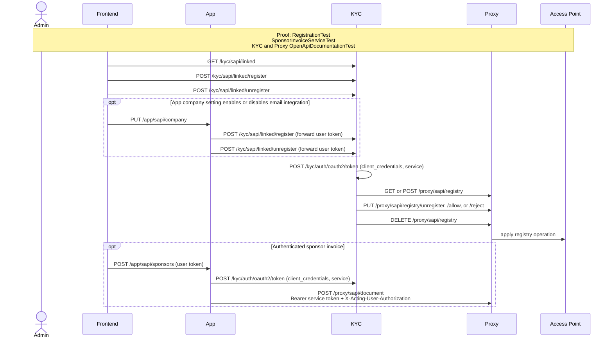

# Service links, registry control, and sponsor invoices

This flow groups authenticated service-link settings with service-scoped registry operations and
sponsor-invoice submission. It distinguishes the user's access token from a service token carrying
the acting-user authorization header.

Executable proof: [`RegistrationTest`](../kyc/src/test/java/org/letspeppol/kyc/controller/RegistrationTest.java) proves KYC's registry call; [`SponsorInvoiceServiceTest`](../app/backend/src/test/java/org/letspeppol/app/service/SponsorInvoiceServiceTest.java) proves client-credentials document submission; Proxy and KYC OpenAPI tests cover the management routes.

Registry route coverage: `/proxy/sapi/registry/allow` and `/proxy/sapi/registry/reject` are the two
app-link decisions represented by "apply registry operation".

Return to the [API network flow guide](./api-network-flows.md).
