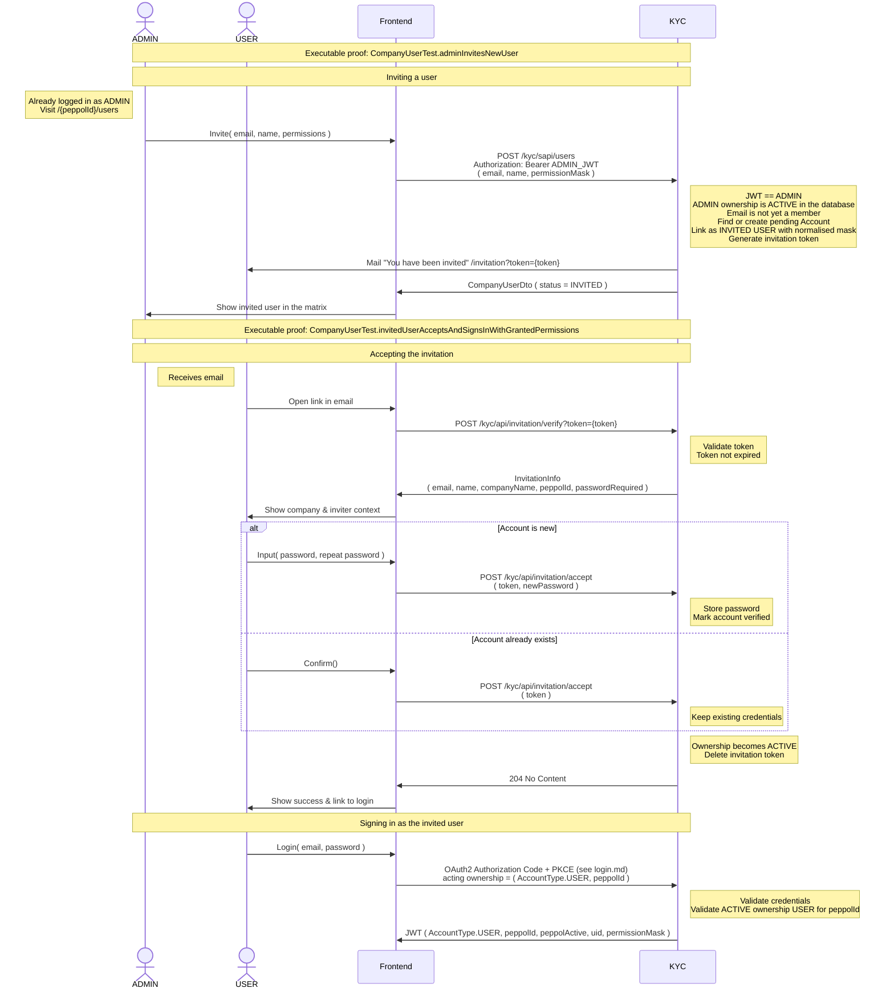

# Company user invitation

Executable proof: [`CompanyUserTest`](../kyc/src/test/java/org/letspeppol/kyc/controller/CompanyUserTest.java), methods `adminInvitesNewUser`, `invitedUserAcceptsAndSignsInWithGrantedPermissions` and `existingAccountAcceptsWithoutChoosingAPassword`.

The ADMIN can afterwards change the mask, suspend, reactivate or remove the user and resend a pending
invitation; see [Company users, invitations, and permissions](./api-company-users.md) for those routes,
the permission bits and the error codes.
