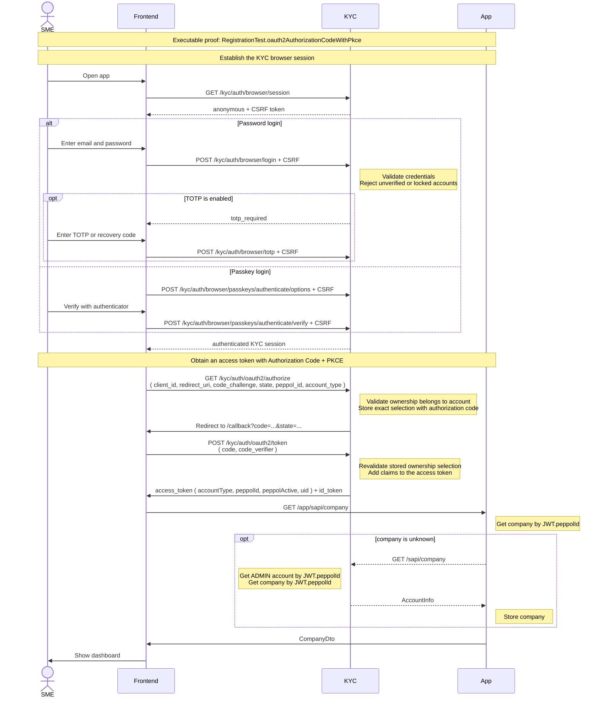

# Login

Login runs as an OAuth2 Authorization Code flow with PKCE against KYC (the authorization server).
The login interface is an Aurelia component in `app/ui`, while credential validation and the browser
session remain owned by KYC. The UI first establishes a KYC session with a CSRF-protected password,
TOTP/recovery-code, or passkey request. It then starts the OAuth flow and exchanges the authorization
code for an access token. Passwords and MFA codes are never exchanged directly for a JWT, and the
OAuth password grant is not enabled.

Protected application URLs start with the active Peppol ID, for example
`/0208:0123456789/invoices/17`. The UI sends that Peppol ID and the tab's remembered account type as
`peppol_id` and `account_type` on the authorization request. KYC validates the ownership, stores the
exact selection with the authorization code, and revalidates it during token exchange. `lastUsed` is
only the default when login or a context-free `/dashboard` request supplies no selection.

Executable proof: [`RegistrationTest`](../kyc/src/test/java/org/letspeppol/kyc/controller/RegistrationTest.java), method `oauth2AuthorizationCodeWithPkce`. TOTP and passkey branches are covered by [`TotpAuthenticationSuccessHandlerTest`](../kyc/src/test/java/org/letspeppol/kyc/config/TotpAuthenticationSuccessHandlerTest.java) and [`PasskeyControllerBrowserAuthTest`](../kyc/src/test/java/org/letspeppol/kyc/controller/PasskeyControllerBrowserAuthTest.java).

The SPA keeps tokens in memory only. On reload, or when the access token expires, it re-authorizes
silently (`prompt=none`) against the HttpOnly KYC session cookie instead of storing a refresh token.
Every contextual renewal gets its Peppol ID from the URL and its role from `sessionStorage`, so tabs
can renew different ownerships independently. A pending relative URL is also kept in
`sessionStorage` during interactive login and restored after `/callback`, including its query and
fragment.
The login page's "remember my email" option remembers only the email address; it does not persist an access
token or bypass KYC authentication.
