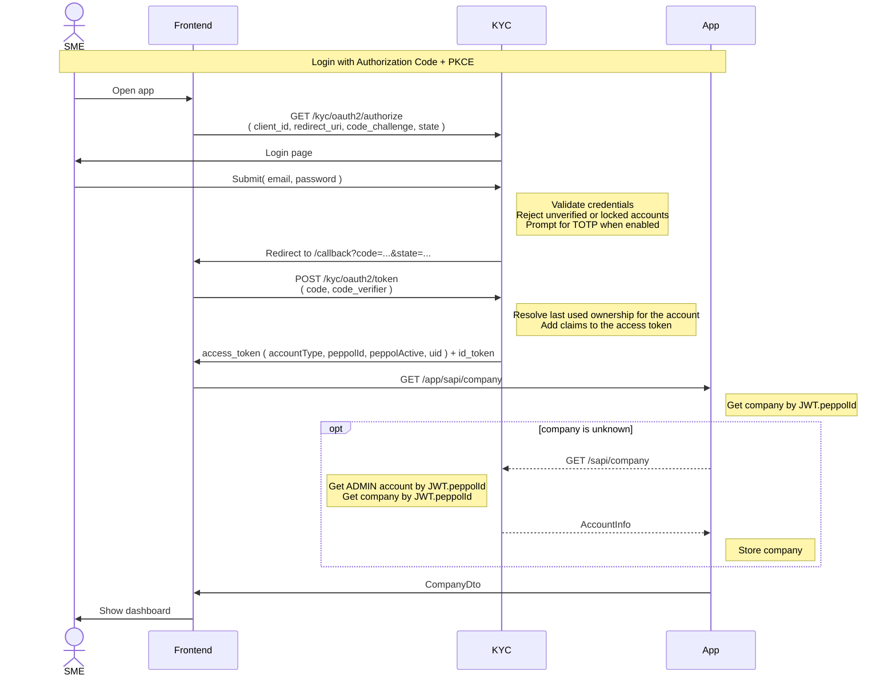

# Login

Login runs as an OAuth2 Authorization Code flow with PKCE against KYC (the authorization server).
Credentials are entered on KYC's own login page, never in the SPA, and the access token is minted by
KYC rather than handed out by a custom endpoint. The acting ownership carried in the token is the
account's most recently used one — see [swap.md](swap.md) for changing it.

The SPA keeps tokens in memory only. On reload, or when the access token expires, it re-authorizes
silently (`prompt=none`) against the KYC session cookie instead of storing a refresh token.
