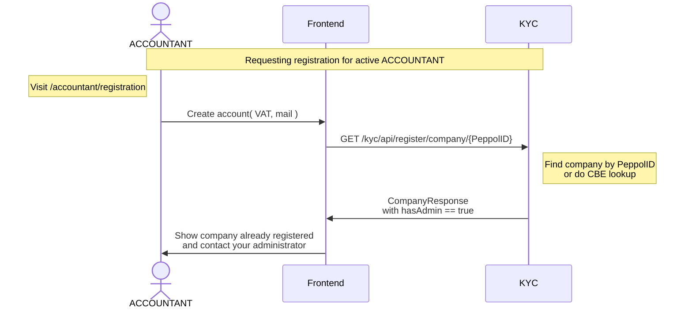

# Registration active ACCOUNTANT

```mermaid
sequenceDiagram
    actor ACCOUNTANT as ACCOUNTANT
    participant Frontend as Frontend
    participant KYC as KYC

Note over ACCOUNTANT, KYC: Requesting registration for active ACCOUNTANT
    Note left of ACCOUNTANT: Visit /accountant/registration
    ACCOUNTANT ->> Frontend: Create account( VAT, mail )
    Frontend ->> KYC: GET /kyc/api/register/company/{PeppolID}
    Note right of KYC: Find company by PeppolID <br> or do CBE lookup
    KYC ->> Frontend: CompanyResponse <br> with hasAdmin == true
    Frontend ->> ACCOUNTANT: Show company already registered <br> and contact your administrator
```
