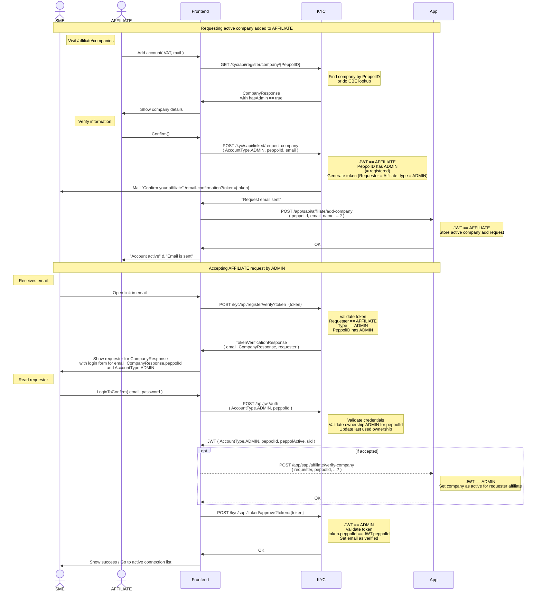

# Registration active ADMIN via AFFILIATE and verify by email

```mermaid
sequenceDiagram
    actor SME as SME
    actor AFFILIATE as AFFILIATE
    participant Frontend as Frontend
    participant KYC as KYC
    participant App as App

Note over SME, App: Requesting active company added to AFFILIATE
    Note left of AFFILIATE: Visit /affiliate/companies
    AFFILIATE ->> Frontend: Add account( VAT, mail )
    Frontend ->> KYC: GET /kyc/api/register/company/{PeppolID}
    Note right of KYC: Find company by PeppolID <br> or do CBE lookup
    KYC ->> Frontend: CompanyResponse <br> with hasAdmin == true
    Frontend ->> AFFILIATE: Show company details

    Note left of AFFILIATE: Verify information
    AFFILIATE ->> Frontend: Confirm()
    Frontend ->> KYC: POST /kyc/sapi/linked/request-company <br> ( AccountType.ADMIN, peppolId, email )
    Note right of KYC: JWT == AFFILIATE <br> PeppolID has ADMIN <br>(= registered) <br> Generate token (Requester = Affiliate, type = ADMIN)
    KYC ->> SME: Mail "Confirm your affiliate" /email-confirmation?token={token}
    KYC ->> Frontend: "Request email sent"
    Frontend ->> App: POST /app/sapi/affiliate/add-company <br> ( peppolId, email, name, ...? )
    Note right of App: JWT == AFFILIATE <br> Store active company add request
    App ->> Frontend: OK
    Frontend ->> AFFILIATE: "Account active" & "Email is sent"

Note over SME, App: Accepting AFFILIATE request by ADMIN
    Note left of SME: Receives email
    SME ->> Frontend: Open link in email
    Frontend ->> KYC: POST /kyc/api/register/verify?token={token}
    Note right of KYC: Validate token <br> Requester == AFFILIATE <br> Type == ADMIN <br> PeppolID has ADMIN
    KYC ->> Frontend: TokenVerificationResponse <br> ( email, CompanyResponse, requester )
    Frontend ->> SME: Show requester for CompanyResponse <br> with login form for email, CompanyResponse.peppolId <br> and AccountType.ADMIN

    Note left of SME: Read requester
    SME ->> Frontend: LoginToConfirm( email, password )
    Frontend ->> KYC: POST /api/jwt/auth <br> ( AccountType.ADMIN, peppolId )
    Note right of KYC: Validate credentials <br> Validate ownership ADMIN for peppolId <br> Update last used ownership
    KYC ->> Frontend: JWT ( AccountType.ADMIN, peppolId, peppolActive, uid )
    opt if accepted
        Frontend -->> App: POST /app/sapi/affiliate/verify-company <br> ( requester, peppolId, ...? )
        Note right of App: JWT == ADMIN <br> Set company as active for requester affiliate
        App -->> Frontend: OK
    end
    Frontend ->> KYC: POST /kyc/sapi/linked/approve?token={token}
    Note right of KYC: JWT == ADMIN <br> Validate token <br> token.peppolId == JWT.peppolId <br> Set email as verified
    KYC ->> Frontend: OK
    Frontend ->> SME: Show success / Go to active connection list
```
