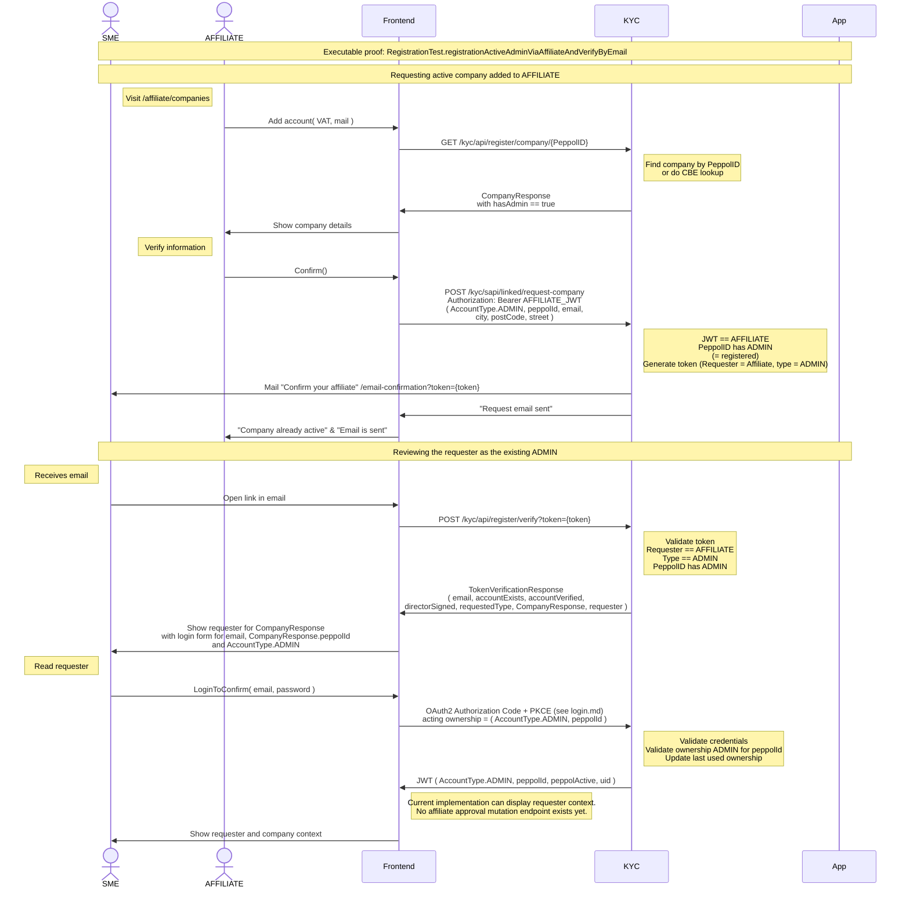

# Registration active ADMIN via AFFILIATE and verify by email

Executable proof: [`RegistrationTest`](../kyc/src/test/java/org/letspeppol/kyc/controller/RegistrationTest.java), method `registrationActiveAdminViaAffiliateAndVerifyByEmail`.

