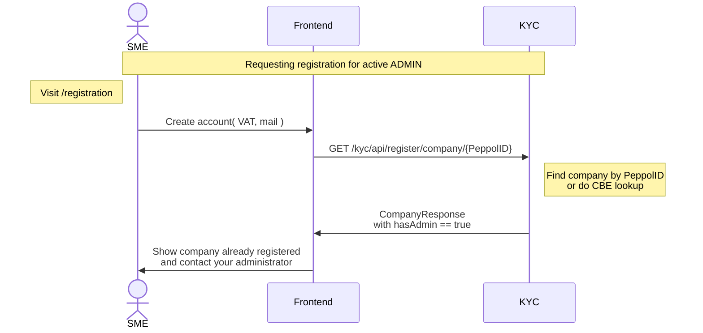

# Registration active ADMIN

```mermaid
sequenceDiagram
    actor SME as SME
    participant Frontend as Frontend
    participant KYC as KYC

Note over SME, KYC: Requesting registration for active ADMIN
    Note left of SME: Visit /registration
    SME ->> Frontend: Create account( VAT, mail )
    Frontend ->> KYC: GET /kyc/api/register/company/{PeppolID}
    Note right of KYC: Find company by PeppolID <br> or do CBE lookup
    KYC ->> Frontend: CompanyResponse <br> with hasAdmin == true
    Frontend ->> SME: Show company already registered <br> and contact your administrator
```
