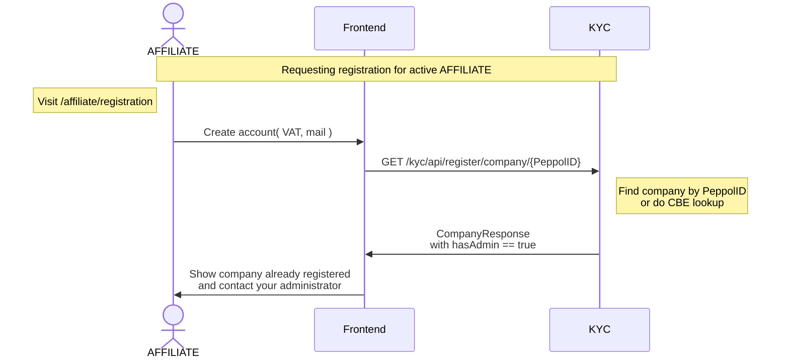

# Registration active AFFILIATE

```mermaid
sequenceDiagram
    actor AFFILIATE as AFFILIATE
    participant Frontend as Frontend
    participant KYC as KYC

Note over AFFILIATE, KYC: Requesting registration for active AFFILIATE
    Note left of AFFILIATE: Visit /affiliate/registration
    AFFILIATE ->> Frontend: Create account( VAT, mail )
    Frontend ->> KYC: GET /kyc/api/register/company/{PeppolID}
    Note right of KYC: Find company by PeppolID <br> or do CBE lookup
    KYC ->> Frontend: CompanyResponse <br> with hasAdmin == true
    Frontend ->> AFFILIATE: Show company already registered <br> and contact your administrator
```
