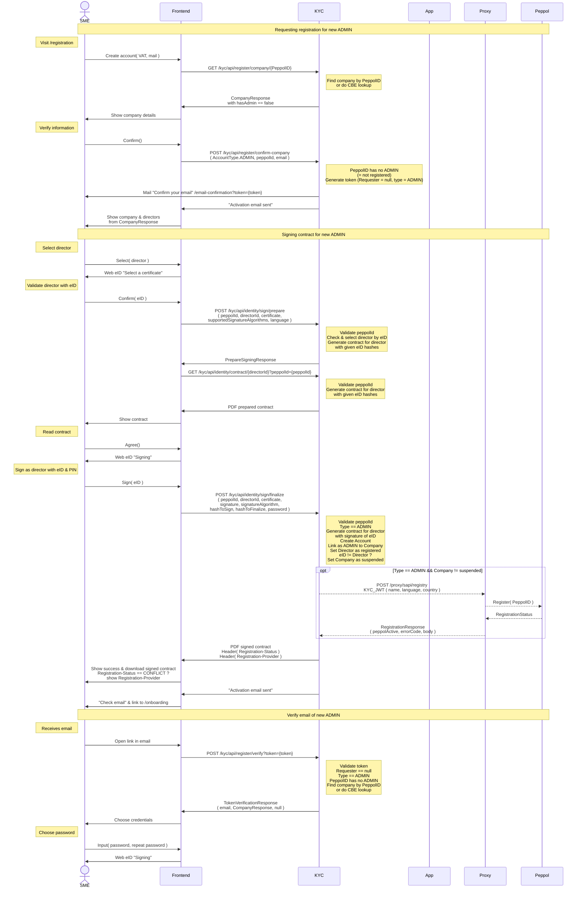

# Registration new ADMIN and sign before email verification

```mermaid
sequenceDiagram
    actor SME as SME
    participant Frontend as Frontend
    participant KYC as KYC
    participant App as App
    participant Proxy as Proxy
    participant Peppol as Peppol

Note over SME, Peppol: Requesting registration for new ADMIN
    Note left of SME: Visit /registration
    SME ->> Frontend: Create account( VAT, mail )
    Frontend ->> KYC: GET /kyc/api/register/company/{PeppolID}
    Note right of KYC: Find company by PeppolID <br> or do CBE lookup
    KYC ->> Frontend: CompanyResponse <br> with hasAdmin == false
    Frontend ->> SME: Show company details

    Note left of SME: Verify information
    SME ->> Frontend: Confirm()
    Frontend ->> KYC: POST /kyc/api/register/confirm-company <br> ( AccountType.ADMIN, peppolId, email )
    Note right of KYC: PeppolID has no ADMIN <br>(= not registered) <br> Generate token (Requester = null, type = ADMIN)
    KYC ->> SME: Mail "Confirm your email" /email-confirmation?token={token}
    KYC ->> Frontend: "Activation email sent"
    Frontend ->> SME: Show company & directors <br> from CompanyResponse

Note over SME, Peppol: Signing contract for new ADMIN
    Note left of SME: Select director
    SME ->> Frontend: Select( director )
    Frontend ->> SME: Web eID "Select a certificate"

    Note left of SME: Validate director with eID
    SME ->> Frontend: Confirm( eID )
    Frontend ->> KYC: POST /kyc/api/identity/sign/prepare <br> ( peppolId, directorId, certificate, <br> supportedSignatureAlgorithms, language )
    Note right of KYC: Validate peppolId <br> Check & select director by eID <br> Generate contract for director <br> with given eID hashes
    KYC ->> Frontend: PrepareSigningResponse
    Frontend ->> KYC: GET /kyc/api/identity/contract/{directorId}?peppolId={peppolId}
    Note right of KYC: Validate peppolId <br> Generate contract for director <br> with given eID hashes
    KYC ->> Frontend: PDF prepared contract
    Frontend ->> SME: Show contract

    Note left of SME: Read contract
    SME ->> Frontend: Agree()
    Frontend ->> SME: Web eID "Signing"

    Note left of SME: Sign as director with eID & PIN
    SME ->> Frontend: Sign( eID )
    Frontend ->> KYC: POST /kyc/api/identity/sign/finalize <br> ( peppolId, directorId, certificate, <br> signature, signatureAlgorithm, <br> hashToSign, hashToFinalize, password )
    Note right of KYC: Validate peppolId <br> Type == ADMIN <br> Generate contract for director <br> with signature of eID <br> Create Account <br> Link as ADMIN to Company <br> Set Director as registered <br> eID != Director ? <br> Set Company as suspended
    opt Type == ADMIN && Company != suspended
        KYC -->> Proxy: POST /proxy/sapi/registry <br> KYC_JWT ( name, language, country )
        Proxy -->> Peppol: Register( PeppolID )
        Peppol -->> Proxy: RegistrationStatus
        Proxy -->> KYC: RegistrationResponse <br> ( peppolActive, errorCode, body )
    end
    KYC ->> Frontend: PDF signed contract <br> Header( Registration-Status ) <br> Header( Registration-Provider )
    Frontend ->> SME: Show success & download signed contract <br> Registration-Status == CONFLICT ? <br> show Registration-Provider
    # TODO : went do we give information ?
    KYC ->> Frontend: "Activation email sent"
    Frontend ->> SME: "Check email" & link to /onboarding

Note over SME, Peppol: Verify email of new ADMIN
    Note left of SME: Receives email
    SME ->> Frontend: Open link in email
    Frontend ->> KYC: POST /kyc/api/register/verify?token={token}
    Note right of KYC: Validate token <br> Requester == null <br> Type == ADMIN <br> PeppolID has no ADMIN <br> Find company by PeppolID <br> or do CBE lookup
    KYC ->> Frontend: TokenVerificationResponse <br> ( email, CompanyResponse, null )
    Frontend ->> SME: Choose credentials

    Note left of SME: Choose password
    SME ->> Frontend: Input( password, repeat password )
    # TODO 
    Frontend ->> SME: Web eID "Signing"
```
