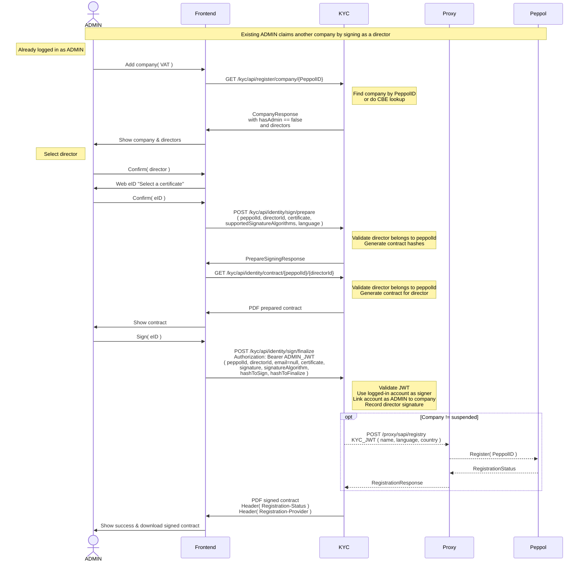

# Registration new ADMIN by active ADMIN

```mermaid
sequenceDiagram
    actor ADMIN as ADMIN
    participant Frontend as Frontend
    participant KYC as KYC
    participant Proxy as Proxy
    participant Peppol as Peppol

Note over ADMIN, Peppol: Existing ADMIN claims another company by signing as a director
    Note left of ADMIN: Already logged in as ADMIN
    ADMIN ->> Frontend: Add company( VAT )
    Frontend ->> KYC: GET /kyc/api/register/company/{PeppolID}
    Note right of KYC: Find company by PeppolID <br> or do CBE lookup
    KYC ->> Frontend: CompanyResponse <br> with hasAdmin == false <br> and directors
    Frontend ->> ADMIN: Show company & directors

    Note left of ADMIN: Select director
    ADMIN ->> Frontend: Confirm( director )
    Frontend ->> ADMIN: Web eID "Select a certificate"
    ADMIN ->> Frontend: Confirm( eID )
    Frontend ->> KYC: POST /kyc/api/identity/sign/prepare <br> ( peppolId, directorId, certificate, <br> supportedSignatureAlgorithms, language )
    Note right of KYC: Validate director belongs to peppolId <br> Generate contract hashes
    KYC ->> Frontend: PrepareSigningResponse

    Frontend ->> KYC: GET /kyc/api/identity/contract/{peppolId}/{directorId}
    Note right of KYC: Validate director belongs to peppolId <br> Generate contract for director
    KYC ->> Frontend: PDF prepared contract
    Frontend ->> ADMIN: Show contract

    ADMIN ->> Frontend: Sign( eID )
    Frontend ->> KYC: POST /kyc/api/identity/sign/finalize <br> Authorization: Bearer ADMIN_JWT <br> ( peppolId, directorId, email=null, certificate, <br> signature, signatureAlgorithm, <br> hashToSign, hashToFinalize )
    Note right of KYC: Validate JWT <br> Use logged-in account as signer <br> Link account as ADMIN to company <br> Record director signature
    opt Company != suspended
        KYC -->> Proxy: POST /proxy/sapi/registry <br> KYC_JWT ( name, language, country )
        Proxy -->> Peppol: Register( PeppolID )
        Peppol -->> Proxy: RegistrationStatus
        Proxy -->> KYC: RegistrationResponse
    end
    KYC ->> Frontend: PDF signed contract <br> Header( Registration-Status ) <br> Header( Registration-Provider )
    Frontend ->> ADMIN: Show success & download signed contract
```
