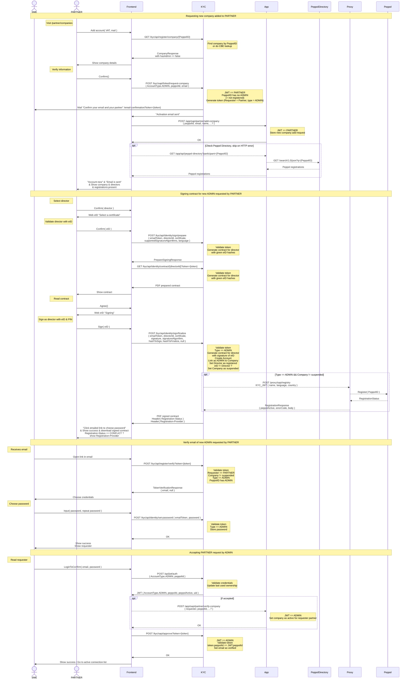

# Registration new ADMIN via PARTNER and sign before email verification

```mermaid
sequenceDiagram
    actor SME as SME
    actor PARTNER as PARTNER
    participant Frontend as Frontend
    participant KYC as KYC
    participant App as App
    participant PeppolDirectory as PeppolDirectory
    participant Proxy as Proxy
    participant Peppol as Peppol

Note over SME, Peppol: Requesting new company added to PARTNER
    Note left of PARTNER: Visit /partner/companies
    PARTNER ->> Frontend: Add account( VAT, mail )
    Frontend ->> KYC: GET /kyc/api/register/company/{PeppolID}
    Note right of KYC: Find company by PeppolID <br> or do CBE lookup
    KYC ->> Frontend: CompanyResponse <br> with hasAdmin == false
    Frontend ->> PARTNER: Show company details

    Note left of PARTNER: Verify information
    PARTNER ->> Frontend: Confirm()
    Frontend ->> KYC: POST /kyc/sapi/linked/request-company <br> ( AccountType.ADMIN, peppolId, email )
    Note right of KYC: JWT == PARTNER <br> PeppolID has no ADMIN <br>(= not registered) <br> Generate token (Requester = Partner, type = ADMIN)
    KYC ->> SME: Mail "Confirm your email and your partner" /email-confirmation?token={token}
    KYC ->> Frontend: "Activation email sent"
    Frontend ->> App: POST /app/sapi/partner/add-company <br> ( peppolId, email, name, ...? )
    Note right of App: JWT == PARTNER <br> Store new company add request
    App ->> Frontend: OK
    opt Check Peppol Directory, skip on HTTP error
        Frontend -->> App: GET /app/api/peppol-directory?participant={PeppolID}
        App -->> PeppolDirectory: GET /search/1.0/json?q={PeppolID}
        PeppolDirectory -->> App: Peppol registrations
        App -->> Frontend: Peppol registrations
    end
    Frontend ->> PARTNER: "Account new" & "Email is sent" <br> & Show company & directors <br> & registrations present

Note over SME, Peppol: Signing contract for new ADMIN requested by PARTNER
    Note left of PARTNER: Select director
    PARTNER ->> Frontend: Confirm( director )
    Frontend ->> PARTNER: Web eID "Select a certificate"

    Note left of PARTNER: Validate director with eID
    PARTNER ->> Frontend: Confirm( eID )
    Frontend ->> KYC: POST /kyc/api/identity/sign/prepare <br> ( emailToken, directorId, certificate, <br> supportedSignatureAlgorithms, language )
    Note right of KYC: Validate token <br> Generate contract for director <br> with given eID hashes
    KYC ->> Frontend: PrepareSigningResponse
    Frontend ->> KYC: GET /kyc/api/identity/contract/{directorId}?token={token}
    Note right of KYC: Validate token <br> Generate contract for director <br> with given eID hashes
    KYC ->> Frontend: PDF prepared contract
    Frontend ->> PARTNER: Show contract

    Note left of PARTNER: Read contract
    PARTNER ->> Frontend: Agree()
    Frontend ->> PARTNER: Web eID "Signing"

    Note left of PARTNER: Sign as director with eID & PIN
    PARTNER ->> Frontend: Sign( eID )
    Frontend ->> KYC: POST /kyc/api/identity/sign/finalize <br> ( emailToken, directorId, certificate, <br> signature, signatureAlgorithm, <br> hashToSign, hashToFinalize, null )
    Note right of KYC: Validate token <br> Type == ADMIN <br> Generate contract for director <br> with signature of eID <br> Create Account <br> Link as ADMIN to Company <br> Set Director as registered <br> eID != Director ? <br> Set Company as suspended
    opt Type == ADMIN && Company != suspended
        KYC -->> Proxy: POST /proxy/sapi/registry <br> KYC_JWT ( name, language, country )
        Proxy -->> Peppol: Register( PeppolID )
        Peppol -->> Proxy: RegistrationStatus
        Proxy -->> KYC: RegistrationResponse <br> ( peppolActive, errorCode, body )
    end
    KYC ->> Frontend: PDF signed contract <br> Header( Registration-Status ) <br> Header( Registration-Provider )
%%    critical We cannot do this
%%        Frontend ->> App: POST /app/sapi/partner/verify-company <br> ( requester, peppolId, ...? )
%%        Note right of App: JWT == PARTNER <br> Set company as active for requester partner
%%        App ->> Frontend: OK
%%    end
    Frontend ->> PARTNER: "Click emailed link to choose password" <br> & Show success & download signed contract <br> Registration-Status == CONFLICT ? <br> show Registration-Provider

Note over SME, Peppol: Verify email of new ADMIN requested by PARTNER
    Note left of SME: Receives email
    SME ->> Frontend: Open link in email
    Frontend ->> KYC: POST /kyc/api/register/verify?token={token}
    Note right of KYC: Validate token <br> Requester == PARTNER <br> Company != suspended <br> Type == ADMIN <br> PeppolID has ADMIN
    KYC ->> Frontend: TokenVerificationResponse <br> ( email, null )
    Frontend ->> SME: Choose credentials

    Note left of SME: Choose password
    SME ->> Frontend: Input( password, repeat password )
    Frontend ->> KYC: POST /kyc/api/identity/set-password ( emailToken, password )
    Note right of KYC: Validate token <br> Type == ADMIN <br> Store password
    KYC ->> Frontend: OK
    Frontend ->> SME: Show success <br> Show requester

Note over SME, Peppol: Accepting PARTNER request by ADMIN
    Note left of SME: Read requester
    SME ->> Frontend: LoginToConfirm( email, password )
    Frontend ->> KYC: POST /api/jwt/auth <br> ( AccountType.ADMIN, peppolId )
    Note right of KYC: Validate credentials <br> Update last used ownership
    KYC ->> Frontend: JWT ( AccountType.ADMIN, peppolId, peppolActive, uid )
    opt if accepted
        Frontend -->> App: POST /app/sapi/partner/verify-company <br> ( requester, peppolId, ...? )
        Note right of App: JWT == ADMIN <br> Set company as active for requester partner
        App -->> Frontend: OK
    end
    Frontend ->> KYC: POST /kyc/sapi/approve?token={token}
    Note right of KYC: JWT == ADMIN <br> Validate token <br> token.peppolId == JWT.peppolId <br> Set email as verified
    KYC ->> Frontend: OK
    Frontend ->> SME: Show success / Go to active connection list
```
