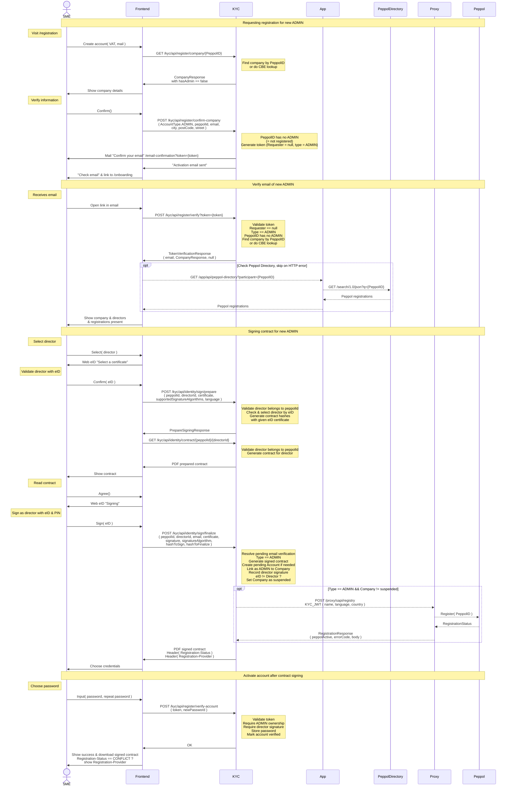

# Registration new ADMIN

```mermaid
sequenceDiagram
    actor SME as SME
    participant Frontend as Frontend
    participant KYC as KYC
    participant App as App
    participant PeppolDirectory as PeppolDirectory
    participant Proxy as Proxy
    participant Peppol as Peppol

Note over SME, Peppol: Requesting registration for new ADMIN
    Note left of SME: Visit /registration
    SME ->> Frontend: Create account( VAT, mail )
    Frontend ->> KYC: GET /kyc/api/register/company/{PeppolID}
    Note right of KYC: Find company by PeppolID <br> or do CBE lookup
    KYC ->> Frontend: CompanyResponse <br> with hasAdmin == false
    Frontend ->> SME: Show company details

    Note left of SME: Verify information
    SME ->> Frontend: Confirm()
    Frontend ->> KYC: POST /kyc/api/register/confirm-company <br> ( AccountType.ADMIN, peppolId, email, <br> city, postCode, street )
    Note right of KYC: PeppolID has no ADMIN <br>(= not registered) <br> Generate token (Requester = null, type = ADMIN)
    KYC ->> SME: Mail "Confirm your email" /email-confirmation?token={token}
    KYC ->> Frontend: "Activation email sent"
    Frontend ->> SME: "Check email" & link to /onboarding

Note over SME, Peppol: Verify email of new ADMIN
    Note left of SME: Receives email
    SME ->> Frontend: Open link in email
    Frontend ->> KYC: POST /kyc/api/register/verify?token={token}
    Note right of KYC: Validate token <br> Requester == null <br> Type == ADMIN <br> PeppolID has no ADMIN <br> Find company by PeppolID <br> or do CBE lookup
    KYC ->> Frontend: TokenVerificationResponse <br> ( email, CompanyResponse, null )
    opt Check Peppol Directory, skip on HTTP error
        Frontend -->> App: GET /app/api/peppol-directory?participant={PeppolID}
        App -->> PeppolDirectory: GET /search/1.0/json?q={PeppolID}
        PeppolDirectory -->> App: Peppol registrations
        App -->> Frontend: Peppol registrations
    end
    Frontend ->> SME: Show company & directors <br> & registrations present

Note over SME, Peppol: Signing contract for new ADMIN
    Note left of SME: Select director
    SME ->> Frontend: Select( director )
    Frontend ->> SME: Web eID "Select a certificate"

    Note left of SME: Validate director with eID
    SME ->> Frontend: Confirm( eID )
    Frontend ->> KYC: POST /kyc/api/identity/sign/prepare <br> ( peppolId, directorId, certificate, <br> supportedSignatureAlgorithms, language )
    Note right of KYC: Validate director belongs to peppolId <br> Check & select director by eID <br> Generate contract hashes <br> with given eID certificate
    KYC ->> Frontend: PrepareSigningResponse
    Frontend ->> KYC: GET /kyc/api/identity/contract/{peppolId}/{directorId}
    Note right of KYC: Validate director belongs to peppolId <br> Generate contract for director
    KYC ->> Frontend: PDF prepared contract
    Frontend ->> SME: Show contract

    Note left of SME: Read contract
    SME ->> Frontend: Agree()
    Frontend ->> SME: Web eID "Signing"

    Note left of SME: Sign as director with eID & PIN
    SME ->> Frontend: Sign( eID )
    Frontend ->> KYC: POST /kyc/api/identity/sign/finalize <br> ( peppolId, directorId, email, certificate, <br> signature, signatureAlgorithm, <br> hashToSign, hashToFinalize )
    Note right of KYC: Resolve pending email verification <br> Type == ADMIN <br> Generate signed contract <br> Create pending Account if needed <br> Link as ADMIN to Company <br> Record director signature <br> eID != Director ? <br> Set Company as suspended
    opt Type == ADMIN && Company != suspended
        KYC -->> Proxy: POST /proxy/sapi/registry <br> KYC_JWT ( name, language, country )
        Proxy -->> Peppol: Register( PeppolID )
        Peppol -->> Proxy: RegistrationStatus
        Proxy -->> KYC: RegistrationResponse <br> ( peppolActive, errorCode, body )
    end
    KYC ->> Frontend: PDF signed contract <br> Header( Registration-Status ) <br> Header( Registration-Provider )
    Frontend ->> SME: Choose credentials

Note over SME, Peppol: Activate account after contract signing
    Note left of SME: Choose password
    SME ->> Frontend: Input( password, repeat password )
    Frontend ->> KYC: POST /kyc/api/register/verify-account <br> ( token, newPassword )
    Note right of KYC: Validate token <br> Require ADMIN ownership <br> Require director signature <br> Store password <br> Mark account verified
    KYC ->> Frontend: OK
    Frontend ->> SME: Show success & download signed contract <br> Registration-Status == CONFLICT ? <br> show Registration-Provider
```
