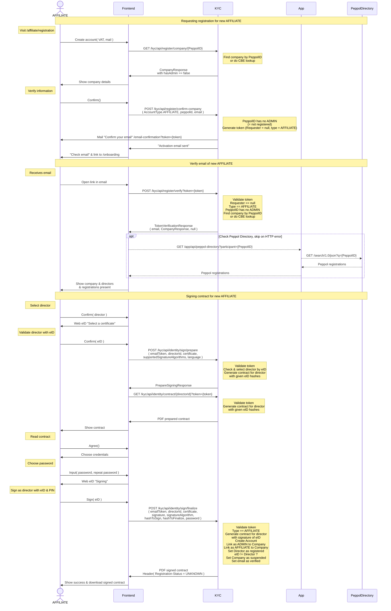

# Registration new AFFILIATE

```mermaid
sequenceDiagram
    actor AFFILIATE as AFFILIATE
    participant Frontend as Frontend
    participant KYC as KYC
    participant App as App
    participant PeppolDirectory as PeppolDirectory

Note over AFFILIATE, PeppolDirectory: Requesting registration for new AFFILIATE
    Note left of AFFILIATE: Visit /affiliate/registration
    AFFILIATE ->> Frontend: Create account( VAT, mail )
    Frontend ->> KYC: GET /kyc/api/register/company/{PeppolID}
    Note right of KYC: Find company by PeppolID <br> or do CBE lookup
    KYC ->> Frontend: CompanyResponse <br> with hasAdmin == false
    Frontend ->> AFFILIATE: Show company details

    Note left of AFFILIATE: Verify information
    AFFILIATE ->> Frontend: Confirm()
    Frontend ->> KYC: POST /kyc/api/register/confirm-company <br> ( AccountType.AFFILIATE, peppolId, email )
    Note right of KYC: PeppolID has no ADMIN <br>(= not registered) <br> Generate token (Requester = null, type = AFFILIATE)
    KYC ->> AFFILIATE: Mail "Confirm your email" /email-confirmation?token={token}
    KYC ->> Frontend: "Activation email sent"
    Frontend ->> AFFILIATE: "Check email" & link to /onboarding

Note over AFFILIATE, PeppolDirectory: Verify email of new AFFILIATE
    Note left of AFFILIATE: Receives email
    AFFILIATE ->> Frontend: Open link in email
    Frontend ->> KYC: POST /kyc/api/register/verify?token={token}
    Note right of KYC: Validate token <br> Requester == null <br> Type == AFFILIATE <br> PeppolID has no ADMIN <br> Find company by PeppolID <br> or do CBE lookup
    KYC ->> Frontend: TokenVerificationResponse <br> ( email, CompanyResponse, null )
    opt Check Peppol Directory, skip on HTTP error
        Frontend -->> App: GET /app/api/peppol-directory?participant={PeppolID}
        App -->> PeppolDirectory: GET /search/1.0/json?q={PeppolID}
        PeppolDirectory -->> App: Peppol registrations
        App -->> Frontend: Peppol registrations
    end
    Frontend ->> AFFILIATE: Show company & directors <br> & registrations present

Note over AFFILIATE, PeppolDirectory: Signing contract for new AFFILIATE
    Note left of AFFILIATE: Select director
    AFFILIATE ->> Frontend: Confirm( director )
    Frontend ->> AFFILIATE: Web eID "Select a certificate"

    Note left of AFFILIATE: Validate director with eID
    AFFILIATE ->> Frontend: Confirm( eID )
    Frontend ->> KYC: POST /kyc/api/identity/sign/prepare <br> ( emailToken, directorId, certificate, <br> supportedSignatureAlgorithms, language )
    Note right of KYC: Validate token <br> Check & select director by eID <br> Generate contract for director <br> with given eID hashes
    KYC ->> Frontend: PrepareSigningResponse
    Frontend ->> KYC: GET /kyc/api/identity/contract/{directorId}?token={token}
    Note right of KYC: Validate token <br> Generate contract for director <br> with given eID hashes
    KYC ->> Frontend: PDF prepared contract
    Frontend ->> AFFILIATE: Show contract

    Note left of AFFILIATE: Read contract
    AFFILIATE ->> Frontend: Agree()
    Frontend ->> AFFILIATE: Choose credentials

    Note left of AFFILIATE: Choose password
    AFFILIATE ->> Frontend: Input( password, repeat password )
    Frontend ->> AFFILIATE: Web eID "Signing"

    Note left of AFFILIATE: Sign as director with eID & PIN
    AFFILIATE ->> Frontend: Sign( eID )
    Frontend ->> KYC: POST /kyc/api/identity/sign/finalize <br> ( emailToken, directorId, certificate, <br> signature, signatureAlgorithm, <br> hashToSign, hashToFinalize, password )
    Note right of KYC: Validate token <br> Type == AFFILIATE <br> Generate contract for director <br> with signature of eID <br> Create Account <br> Link as ADMIN to Company <br> Link as AFFILIATE to Company <br> Set Director as registered <br> eID != Director ? <br> Set Company as suspended <br> Set email as verified
    KYC ->> Frontend: PDF signed contract <br> Header( Registration-Status = UNKNOWN )
    Frontend ->> AFFILIATE: Show success & download signed contract
```
