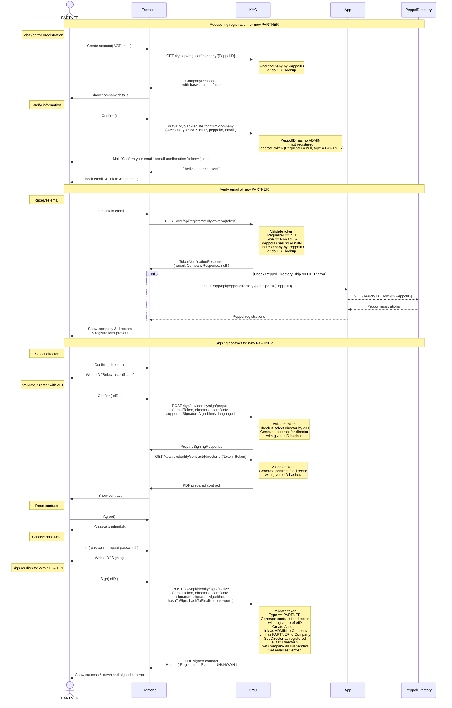

# Registration new PARTNER

```mermaid
sequenceDiagram
    actor PARTNER as PARTNER
    participant Frontend as Frontend
    participant KYC as KYC
    participant App as App
    participant PeppolDirectory as PeppolDirectory

Note over PARTNER, PeppolDirectory: Requesting registration for new PARTNER
    Note left of PARTNER: Visit /partner/registration
    PARTNER ->> Frontend: Create account( VAT, mail )
    Frontend ->> KYC: GET /kyc/api/register/company/{PeppolID}
    Note right of KYC: Find company by PeppolID <br> or do CBE lookup
    KYC ->> Frontend: CompanyResponse <br> with hasAdmin == false
    Frontend ->> PARTNER: Show company details

    Note left of PARTNER: Verify information
    PARTNER ->> Frontend: Confirm()
    Frontend ->> KYC: POST /kyc/api/register/confirm-company <br> ( AccountType.PARTNER, peppolId, email )
    Note right of KYC: PeppolID has no ADMIN <br>(= not registered) <br> Generate token (Requester = null, type = PARTNER)
    KYC ->> PARTNER: Mail "Confirm your email" /email-confirmation?token={token}
    KYC ->> Frontend: "Activation email sent"
    Frontend ->> PARTNER: "Check email" & link to /onboarding

Note over PARTNER, PeppolDirectory: Verify email of new PARTNER
    Note left of PARTNER: Receives email
    PARTNER ->> Frontend: Open link in email
    Frontend ->> KYC: POST /kyc/api/register/verify?token={token}
    Note right of KYC: Validate token <br> Requester == null <br> Type == PARTNER <br> PeppolID has no ADMIN <br> Find company by PeppolID <br> or do CBE lookup
    KYC ->> Frontend: TokenVerificationResponse <br> ( email, CompanyResponse, null )
    opt Check Peppol Directory, skip on HTTP error
        Frontend -->> App: GET /app/api/peppol-directory?participant={PeppolID}
        App -->> PeppolDirectory: GET /search/1.0/json?q={PeppolID}
        PeppolDirectory -->> App: Peppol registrations
        App -->> Frontend: Peppol registrations
    end
    Frontend ->> PARTNER: Show company & directors <br> & registrations present

Note over PARTNER, PeppolDirectory: Signing contract for new PARTNER
    Note left of PARTNER: Select director
    PARTNER ->> Frontend: Confirm( director )
    Frontend ->> PARTNER: Web eID "Select a certificate"

    Note left of PARTNER: Validate director with eID
    PARTNER ->> Frontend: Confirm( eID )
    Frontend ->> KYC: POST /kyc/api/identity/sign/prepare <br> ( emailToken, directorId, certificate, <br> supportedSignatureAlgorithms, language )
    Note right of KYC: Validate token <br> Check & select director by eID <br> Generate contract for director <br> with given eID hashes
    KYC ->> Frontend: PrepareSigningResponse
    Frontend ->> KYC: GET /kyc/api/identity/contract/{directorId}?token={token}
    Note right of KYC: Validate token <br> Generate contract for director <br> with given eID hashes
    KYC ->> Frontend: PDF prepared contract
    Frontend ->> PARTNER: Show contract

    Note left of PARTNER: Read contract
    PARTNER ->> Frontend: Agree()
    Frontend ->> PARTNER: Choose credentials

    Note left of PARTNER: Choose password
    PARTNER ->> Frontend: Input( password, repeat password )
    Frontend ->> PARTNER: Web eID "Signing"

    Note left of PARTNER: Sign as director with eID & PIN
    PARTNER ->> Frontend: Sign( eID )
    Frontend ->> KYC: POST /kyc/api/identity/sign/finalize <br> ( emailToken, directorId, certificate, <br> signature, signatureAlgorithm, <br> hashToSign, hashToFinalize, password )
    Note right of KYC: Validate token <br> Type == PARTNER <br> Generate contract for director <br> with signature of eID <br> Create Account <br> Link as ADMIN to Company <br> Link as PARTNER to Company <br> Set Director as registered <br> eID != Director ? <br> Set Company as suspended <br> Set email as verified
    KYC ->> Frontend: PDF signed contract <br> Header( Registration-Status = UNKNOWN )
    Frontend ->> PARTNER: Show success & download signed contract
```
