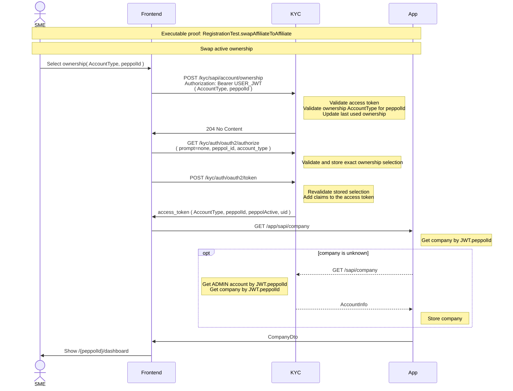

# Swap

An account can own several companies under several roles. Since access tokens are minted by KYC's
authorization server, a swap cannot hand back a new token directly: the frontend records the
selection, then re-authorizes silently to obtain a token carrying the new context.

Selecting an ownership updates `lastUsed` as the future login default. The security input for the
new token is the explicit `peppol_id` and `account_type` on the following authorization request.
The UI also changes the route to `/{peppolId}/dashboard` and remembers the role in tab-local
`sessionStorage` for later silent renewals.

Executable proof: [`RegistrationTest`](../kyc/src/test/java/org/letspeppol/kyc/controller/RegistrationTest.java), method `swapAffiliateToAffiliate`; the PKCE re-authorization is also exercised by `oauth2AuthorizationCodeWithPkce`.

